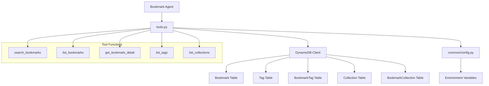

# Design Document: Agent Bookmark Tools

## Overview

Bookmark Agent の DynamoDB アクセスツール群を拡張し、キーワード検索の改善、一覧取得（フィルタ付き）、個別詳細取得、タグ/コレクション一覧取得を実現する。

現在の `bookmark_agent/tools.py` には `search_bookmarks` と `fetch_ogp` のみ実装されている。本設計では既存の `search_bookmarks` を改善しつつ、新規ツール関数を追加する。すべてのツールは `@tool` デコレータで定義し、DynamoDB への直接アクセスは boto3 経由で行う。

### 設計方針

- **既存パターンの踏襲**: `common/config.py` からリージョン取得、`common/logging.py` でロガー設定、環境変数からテーブル名取得
- **データ分離の徹底**: 全ツール関数で `owner_id` パラメータを必須とし、DynamoDB クエリに owner フィルタを含める
- **構造化レスポンス**: ツールの戻り値は LLM が解釈しやすい構造化文字列（JSON 形式の dict/list）
- **グレースフルエラーハンドリング**: boto3 の `ClientError` をキャッチし、ユーザーフレンドリーなメッセージを返す

## Architecture



### レイヤー構成

1. **エントリーポイント層** (`app.py`): AgentCore Runtime との接続。変更なし。
2. **エージェント層** (`agent.py`): ツール登録とシステムプロンプト。新ツールの登録を追加。
3. **ツール層** (`tools.py`): DynamoDB アクセスロジック。本設計の主要変更対象。
4. **共通層** (`common/`): 設定・ログ。テーブル名取得ヘルパーを追加。

## Components and Interfaces

### 1. テーブル設定モジュール (`common/config.py` への追加)

```python
def get_table_names() -> dict[str, str]:
    """DynamoDB テーブル名を環境変数から取得する。
    未設定の場合は ConfigurationError を送出する。
    """
```

返却する辞書:
```python
{
    "bookmark": os.getenv("BOOKMARK_TABLE_NAME"),
    "tag": os.getenv("TAG_TABLE_NAME"),
    "bookmark_tag": os.getenv("BOOKMARKTAG_TABLE_NAME"),
    "collection": os.getenv("COLLECTION_TABLE_NAME"),
    "bookmark_collection": os.getenv("BOOKMARKCOLLECTION_TABLE_NAME"),
}
```

### 2. ツール関数インターフェース

#### `search_bookmarks(query: str, owner_id: str) -> str`

キーワード検索。既存実装を改善し、memo フィールドも検索対象に追加。複数キーワードのマッチ数でランキング。

**パラメータ:**
- `query`: 検索キーワード（スペース区切りで複数指定可）
- `owner_id`: Cognito ユーザー ID

**戻り値:** 検索結果の構造化文字列（件数 + ブックマークリスト）

#### `list_bookmarks(owner_id: str, status: str = "", tag_name: str = "", collection_name: str = "", limit: int = 20) -> str`

フィルタ付き一覧取得。

**パラメータ:**
- `owner_id`: Cognito ユーザー ID
- `status`: ステータスフィルタ（"inbox", "read", "archived"、空文字で全件）
- `tag_name`: タグ名フィルタ（空文字で無効）
- `collection_name`: コレクション名フィルタ（空文字で無効）
- `limit`: 最大取得件数（デフォルト 20）

**戻り値:** 一覧結果の構造化文字列（件数 + ブックマークリスト + more_exists フラグ）

#### `get_bookmark_detail(bookmark_id: str, owner_id: str) -> str`

個別ブックマークの詳細取得（関連タグ・コレクション含む）。

**パラメータ:**
- `bookmark_id`: ブックマーク ID
- `owner_id`: Cognito ユーザー ID

**戻り値:** ブックマーク詳細の構造化文字列（全フィールド + タグ名リスト + コレクション名リスト）

#### `list_tags(owner_id: str) -> str`

ユーザーのタグ一覧取得。

**パラメータ:**
- `owner_id`: Cognito ユーザー ID

**戻り値:** タグ一覧の構造化文字列（件数 + タグリスト）

#### `list_collections(owner_id: str) -> str`

ユーザーのコレクション一覧取得。

**パラメータ:**
- `owner_id`: Cognito ユーザー ID

**戻り値:** コレクション一覧の構造化文字列（件数 + コレクションリスト）

### 3. エージェント登録 (`agent.py` の変更)

```python
from bookmark_agent.tools import (
    fetch_ogp,
    search_bookmarks,
    list_bookmarks,
    get_bookmark_detail,
    list_tags,
    list_collections,
)

agent = Agent(
    system_prompt=SYSTEM_PROMPT,
    tools=[fetch_ogp, search_bookmarks, list_bookmarks, get_bookmark_detail, list_tags, list_collections],
)
```

システムプロンプトも更新し、新ツールの使い分けガイダンスを追加する。

### 4. DynamoDB アクセスパターン

| ツール | テーブル | オペレーション | フィルタ |
|--------|----------|----------------|----------|
| search_bookmarks | Bookmark | Scan | owner = :owner_id + keyword match (in-memory) |
| list_bookmarks | Bookmark, BookmarkTag, Tag, BookmarkCollection, Collection | Scan + Query (GSI) | owner = :owner_id + status/tag/collection |
| get_bookmark_detail | Bookmark, BookmarkTag, Tag, BookmarkCollection, Collection | GetItem + Query (GSI) | owner = :owner_id |
| list_tags | Tag | Scan | owner = :owner_id |
| list_collections | Collection | Scan | owner = :owner_id |

### 5. エラーハンドリング戦略

```python
from botocore.exceptions import ClientError, ConnectTimeoutError, ReadTimeoutError

try:
    # DynamoDB operation
except (ConnectTimeoutError, ReadTimeoutError):
    return "一時的にサービスに接続できません。しばらく待ってから再度お試しください。"
except ClientError as e:
    logger.error("DynamoDB エラー: %s", e.response["Error"]["Message"])
    return f"データの取得中にエラーが発生しました: {e.response['Error']['Code']}"
except Exception as e:
    logger.error("予期しないエラー: %s", str(e))
    return "予期しないエラーが発生しました。管理者にお問い合わせください。"
```

## Data Models

### DynamoDB テーブル構造（Amplify Data 管理）

#### Bookmark テーブル
| フィールド | 型 | 説明 |
|-----------|------|------|
| id | String (PK) | UUID |
| url | String | ブックマーク URL |
| title | String | ページタイトル |
| description | String | ページ説明 |
| memo | String | ユーザーメモ |
| ogpImageUrl | String | OGP 画像 URL |
| status | String | "inbox" / "read" / "archived" |
| accessCount | Number | アクセス回数 |
| lastAccessedAt | String | 最終アクセス日時 (ISO 8601) |
| createdAt | String | 作成日時 |
| updatedAt | String | 更新日時 |
| owner | String | Cognito sub (owner-based auth) |

#### Tag テーブル
| フィールド | 型 | 説明 |
|-----------|------|------|
| id | String (PK) | UUID |
| name | String | タグ名 |
| owner | String | Cognito sub |

#### BookmarkTag テーブル
| フィールド | 型 | 説明 |
|-----------|------|------|
| id | String (PK) | UUID |
| bookmarkId | String | Bookmark ID (GSI) |
| tagId | String | Tag ID (GSI) |
| owner | String | Cognito sub |

#### Collection テーブル
| フィールド | 型 | 説明 |
|-----------|------|------|
| id | String (PK) | UUID |
| name | String | コレクション名 |
| description | String | コレクション説明 |
| owner | String | Cognito sub |

#### BookmarkCollection テーブル
| フィールド | 型 | 説明 |
|-----------|------|------|
| id | String (PK) | UUID |
| bookmarkId | String | Bookmark ID (GSI) |
| collectionId | String | Collection ID (GSI) |
| owner | String | Cognito sub |

### ツール戻り値の構造

#### search_bookmarks レスポンス
```python
{
    "total_count": 5,
    "bookmarks": [
        {"id": "...", "title": "...", "url": "...", "description": "...", "memo": "..."},
        ...
    ]
}
```

#### list_bookmarks レスポンス
```python
{
    "total_count": 15,
    "returned_count": 15,
    "more_exists": False,
    "bookmarks": [
        {"id": "...", "title": "...", "url": "...", "status": "...", "createdAt": "..."},
        ...
    ]
}
```

#### get_bookmark_detail レスポンス
```python
{
    "bookmark": {
        "id": "...", "url": "...", "title": "...", "description": "...",
        "memo": "...", "ogpImageUrl": "...", "status": "...",
        "accessCount": 0, "lastAccessedAt": "", "createdAt": "...", "updatedAt": "..."
    },
    "tags": ["tag1", "tag2"],
    "collections": ["collection1"]
}
```

#### list_tags レスポンス
```python
{
    "total_count": 3,
    "tags": [{"id": "...", "name": "..."}, ...]
}
```

#### list_collections レスポンス
```python
{
    "total_count": 2,
    "collections": [{"id": "...", "name": "...", "description": "..."}, ...]
}
```

## Correctness Properties

*A property is a characteristic or behavior that should hold true across all valid executions of a system — essentially, a formal statement about what the system should do. Properties serve as the bridge between human-readable specifications and machine-verifiable correctness guarantees.*

### Property 1: Owner-based data isolation

*For any* tool function (search_bookmarks, list_bookmarks, get_bookmark_detail, list_tags, list_collections) and *for any* owner_id, all data items in the returned result must have an `owner` field that exactly matches the provided owner_id. No item belonging to a different owner shall ever appear in the results, even if the other owner's ID is a prefix or suffix of the queried owner_id.

**Validates: Requirements 1.2, 2.1, 3.5, 4.4, 7.1, 7.2**

### Property 2: Search keyword matching across fields

*For any* set of bookmarks and *for any* non-empty search query, every bookmark in the search results must contain at least one of the query keywords (case-insensitive) in its title, url, description, or memo field. Conversely, no bookmark that contains none of the keywords in any of these fields shall appear in the results.

**Validates: Requirements 1.1**

### Property 3: Search ranking by relevance

*For any* multi-keyword search query and *for any* set of matching bookmarks, the results shall be ordered by descending number of keyword matches. That is, for any two consecutive results A and B in the list, the match count of A shall be greater than or equal to the match count of B.

**Validates: Requirements 1.4**

### Property 4: Status filter correctness

*For any* valid status value ("inbox", "read", or "archived") and *for any* set of bookmarks, when list_bookmarks is called with that status filter, every bookmark in the result shall have a status field equal to the specified value.

**Validates: Requirements 2.2**

### Property 5: Tag and collection filter correctness

*For any* tag name filter, every bookmark in the list_bookmarks result shall be associated with a tag of that name via the BookmarkTag join table. Similarly, *for any* collection name filter, every bookmark in the result shall be associated with a collection of that name via the BookmarkCollection join table.

**Validates: Requirements 2.3, 2.4**

### Property 6: Limit and pagination behavior

*For any* set of N bookmarks matching the query criteria where N > limit, the returned result shall contain at most `limit` items and the `more_exists` flag shall be True. When N <= limit, all matching items shall be returned and `more_exists` shall be False.

**Validates: Requirements 2.5**

### Property 7: Detail retrieval completeness (round-trip)

*For any* bookmark stored in DynamoDB with associated tags and collections, calling get_bookmark_detail with that bookmark's ID and correct owner_id shall return all bookmark fields (url, title, description, memo, ogpImageUrl, status, accessCount, lastAccessedAt, createdAt, updatedAt) plus the names of all associated tags and collections.

**Validates: Requirements 3.1, 3.2, 3.3**

### Property 8: Empty owner_id rejection

*For any* tool function and *for any* empty or whitespace-only owner_id value, the tool shall return an error message indicating that owner identification is required, without performing any DynamoDB query.

**Validates: Requirements 4.3**

### Property 9: Missing environment variable detection

*For any* required table name environment variable (BOOKMARK_TABLE_NAME, TAG_TABLE_NAME, BOOKMARKTAG_TABLE_NAME, COLLECTION_TABLE_NAME, BOOKMARKCOLLECTION_TABLE_NAME), if that variable is not set, calling get_table_names() shall raise a ConfigurationError with a message identifying the missing variable.

**Validates: Requirements 5.2**

### Property 10: Error handling returns user-friendly message

*For any* DynamoDB ClientError (with any error code), when a tool function encounters this error, it shall return a string message (not raise an exception) that does not contain raw stack traces or internal implementation details.

**Validates: Requirements 6.1**

### Property 11: Total count accuracy

*For any* search or list operation, the `total_count` field in the response shall equal the actual number of items matching the query criteria (before limit truncation is applied).

**Validates: Requirements 6.4**

### Property 12: Response contains required fields

*For any* bookmark returned by search_bookmarks or list_bookmarks, the result shall include at minimum the `id`, `title`, and `url` fields. *For any* tag returned by list_tags, the result shall include `id` and `name`. *For any* collection returned by list_collections, the result shall include `id`, `name`, and `description`.

**Validates: Requirements 6.3, 7.3, 7.4**

## Error Handling

### エラー分類と対応

| エラー種別 | 原因 | 対応 |
|-----------|------|------|
| `ConfigurationError` | テーブル名環境変数未設定 | 初期化時に即座に raise。デプロイ設定の問題を早期検出 |
| `ClientError` | DynamoDB API エラー（権限不足、テーブル不存在等） | ログに詳細記録、ユーザーには簡略メッセージを返却 |
| `ConnectTimeoutError` / `ReadTimeoutError` | ネットワーク接続タイムアウト | 一時的な問題として再試行を促すメッセージを返却 |
| `ValueError` | 無効なパラメータ（空の owner_id 等） | パラメータ検証エラーメッセージを返却 |
| `Exception` | 予期しないエラー | ログに記録、汎用エラーメッセージを返却 |

### エラーメッセージ方針

- ユーザー向けメッセージは日本語で返す（エージェントが日本語で応答するため）
- 内部エラーコードやスタックトレースはログにのみ出力
- DynamoDB のエラーコード（AccessDeniedException 等）はログレベルで記録するが、ユーザーには「データの取得中にエラーが発生しました」程度の簡略メッセージを返す

### 入力バリデーション

各ツール関数の冒頭で以下を検証:
1. `owner_id` が空文字列または None でないこと
2. `status` フィルタが指定された場合、有効な値（"inbox", "read", "archived"）であること
3. `limit` が正の整数であること

## Testing Strategy

### テストフレームワーク

- **pytest**: ユニットテスト・プロパティテスト共通のテストランナー
- **Hypothesis**: プロパティベーステスト（Python 向け PBT ライブラリ）
- **moto**: DynamoDB のモック（AWS サービスモック）
- **pytest-mock**: 汎用モック

### プロパティベーステスト

本機能はデータフィルタリング・検索ロジックを含む純粋な関数的振る舞いが多く、PBT に適している。

**設定:**
- 各プロパティテストは最低 100 イテレーション実行
- Hypothesis の `@given` デコレータと `@settings(max_examples=100)` を使用
- moto で DynamoDB テーブルをモックし、ランダムデータを投入してテスト

**タグ形式:** `# Feature: agent-bookmark-tools, Property {number}: {property_text}`

**対象プロパティ:**
- Property 1: Owner-based data isolation
- Property 2: Search keyword matching
- Property 3: Search ranking by relevance
- Property 4: Status filter correctness
- Property 5: Tag/collection filter correctness
- Property 6: Limit/pagination behavior
- Property 7: Detail retrieval completeness
- Property 8: Empty owner_id rejection
- Property 9: Missing env var detection
- Property 10: Error handling
- Property 11: Total count accuracy
- Property 12: Response required fields

### ユニットテスト（Example-based）

プロパティテストを補完する具体的なシナリオ:

- 検索結果が 0 件の場合のレスポンス形式
- DynamoDB タイムアウト時のエラーメッセージ
- 存在しない bookmark_id での get_bookmark_detail
- 各環境変数が個別に未設定の場合のエラーメッセージ内容
- `get_aws_region()` の値が DynamoDB クライアントに渡されることの確認

### テストディレクトリ構成

```
agents/
├── tests/
│   ├── conftest.py          # moto fixtures, テーブル作成ヘルパー
│   ├── test_tools_props.py  # プロパティベーステスト
│   └── test_tools_unit.py   # ユニットテスト
```

### ローカル実行

```bash
cd agents
pip install -e ".[dev]" hypothesis moto
pytest tests/ -v
```
