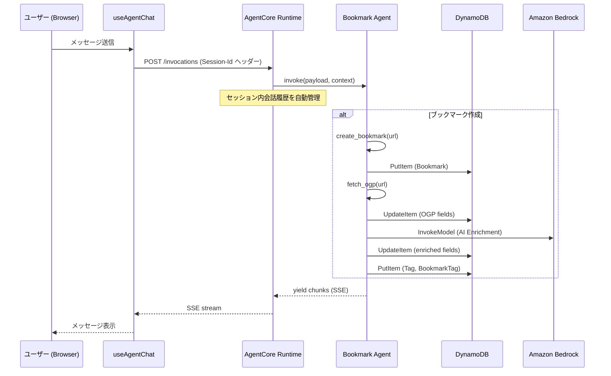

# Design Document: Agent Chat Session CRUD

## Overview

本設計は、Bookmark Agent のチャット体験を改善するための 2 つの主要機能を定義する:

1. **セッション永続化**: フロントエンドの `useAgentChat` フックでセッション ID を同一チャットセッション内で維持し、AgentCore Runtime のセッション管理機能を活用して会話履歴を引き継ぐ
2. **CRUD ツール追加**: エージェントに `create_bookmark`、`update_bookmark`、`delete_bookmark`、`enrich_bookmark` ツールを追加し、自然言語でのデータ操作を可能にする

### 設計方針

- フロントエンド変更は最小限（セッション ID の永続化 + 新規会話ボタン対応）
- エージェント側は既存の `tools.py` パターンに従い、新規ツールを `crud_tools.py` として分離
- AI 補完は既存の `promptBuilder.ts` のロジックを Python に移植し、エージェント内で直接 Bedrock を呼び出す
- owner_id の取得は既存の `app.py` の JWT デコードロジックをそのまま活用

## Architecture



### コンポーネント配置

| レイヤー | ファイル | 責務 |
|---------|---------|------|
| Frontend | `src/hooks/useAgentChat.ts` | セッション ID 永続化、新規会話リセット |
| Frontend | `src/components/agent/AgentChatSection.tsx` | 新規会話ボタン UI |
| Agent | `agents/bookmark_agent/crud_tools.py` | create/update/delete/enrich ツール |
| Agent | `agents/bookmark_agent/enrichment.py` | AI 補完ロジック（Bedrock 直接呼び出し） |
| Agent | `agents/bookmark_agent/agent.py` | ツール登録 + システムプロンプト更新 |
| Agent | `agents/bookmark_agent/app.py` | 変更なし（既存の owner_id 取得ロジックを維持） |

## Components and Interfaces

### 1. Frontend: useAgentChat フック変更

```typescript
// src/hooks/useAgentChat.ts
export interface UseAgentChatReturn {
  messages: ChatMessage[];
  isLoading: boolean;
  error: string | null;
  sendMessage: (text: string) => Promise<void>;
  resetSession: () => void;  // 新規追加
}
```

**変更点:**
- `sessionIdRef` は既存のまま維持（`crypto.randomUUID()` で初期化）
- `resetSession` 関数を追加: 新しい UUID を生成し、メッセージ履歴をクリア
- ページリロード時は React の再マウントにより自動的に新しいセッション ID が生成される（既存動作を維持）

### 2. Agent: create_bookmark ツール

```python
@tool
def create_bookmark(url: str, owner_id: str) -> str:
    """URL を指定してブックマークを新規作成する

    Args:
        url: ブックマークする URL
        owner_id: 所有者 ID

    Returns:
        作成結果メッセージ（ID、タイトル、URL を含む）
    """
```

**処理フロー:**
1. URL 形式バリデーション（`urllib.parse.urlparse`）
2. UUID v4 で ID 生成
3. DynamoDB PutItem（owner, url, status="inbox", createdAt, updatedAt）
4. 成功メッセージを返却

### 3. Agent: update_bookmark ツール

```python
@tool
def update_bookmark(
    bookmark_id: str,
    owner_id: str,
    memo: str = "",
    title: str = "",
    description: str = "",
    status: str = "",
    add_tags: list[str] | None = None,
    remove_tags: list[str] | None = None,
    add_collections: list[str] | None = None,
    remove_collections: list[str] | None = None,
) -> str:
    """ブックマークのフィールドを更新する"""
```

**処理フロー:**
1. GetItem で Bookmark 取得 + owner 検証
2. 指定フィールドの UpdateItem
3. タグ追加: Tag テーブルで検索 → 存在しなければ PutItem → BookmarkTag PutItem
4. タグ削除: BookmarkTag の該当レコードを DeleteItem
5. Collection 追加/削除: 同様のパターン

### 4. Agent: delete_bookmark ツール

```python
@tool
def delete_bookmark(bookmark_id: str, owner_id: str) -> str:
    """ブックマークと関連レコードを削除する"""
```

**処理フロー:**
1. GetItem で Bookmark 取得 + owner 検証
2. BookmarkTag テーブルから関連レコードを Scan → BatchDelete
3. BookmarkCollection テーブルから関連レコードを Scan → BatchDelete
4. Bookmark レコードを DeleteItem

### 5. Agent: enrich_bookmark ツール

```python
@tool
def enrich_bookmark(bookmark_id: str, owner_id: str) -> str:
    """既存ブックマークに AI 補完を実行する"""
```

**処理フロー:**
1. GetItem で Bookmark 取得 + owner 検証
2. 既存タグ・コレクション一覧を取得（プロンプトコンテキスト用）
3. Bedrock InvokeModel でエンリッチメント実行
4. 空フィールドのみに結果を適用
5. suggestedTags → Tag 検索/作成 + BookmarkTag 関連付け
6. suggestedCollection → Collection 検索/作成 + BookmarkCollection 関連付け

### 6. Agent: enrichment モジュール

```python
# agents/bookmark_agent/enrichment.py

def build_enrichment_prompt(
    url: str,
    ogp_title: str,
    ogp_description: str,
    existing_tags: list[str],
    existing_collections: list[str],
) -> str:
    """エンリッチメントプロンプトを構築する（既存 promptBuilder.ts の Python 移植）"""

def invoke_enrichment(prompt: str) -> dict:
    """Bedrock InvokeModel を呼び出し、エンリッチメント結果を返す

    Returns:
        {"suggestedTags": [...], "suggestedMemo": "...", "suggestedTitle": "...",
         "suggestedDescription": "...", "suggestedCollection": "..."}
    """
```

**Bedrock 呼び出し:**
- `boto3` の `bedrock-runtime` クライアントを使用
- モデル ID は `common/config.py` の `get_model_id()` を使用
- Anthropic Messages API フォーマット（既存 `bedrockClient.ts` と同じ）
- タイムアウト: 30 秒（エージェント内なので API Route より長め）

### 7. Owner ID 取得

既存の `app.py` の JWT デコードロジックをそのまま活用:
- `payload.get("access_token")` から JWT を取得
- Base64 デコードで `sub` クレームを抽出
- `sub::sub` 形式に変換
- `create_agent(owner_id=owner_id)` でシステムプロンプトに埋め込み

エージェントのツール呼び出し時、Strands SDK がシステムプロンプトの指示に従い `owner_id` パラメータを自動的に渡す（既存パターンと同じ）。

## Data Models

### DynamoDB テーブル構造（既存）

| テーブル | PK | 主要フィールド |
|---------|-----|--------------|
| Bookmark | id (UUID) | url, title, description, memo, ogpImageUrl, status, owner, createdAt, updatedAt |
| Tag | id (UUID) | name, owner |
| BookmarkTag | id (UUID) | bookmarkId, tagId, owner |
| Collection | id (UUID) | name, description, owner |
| BookmarkCollection | id (UUID) | bookmarkId, collectionId, owner |

### owner フィールドの形式

Amplify の owner-based authorization は `sub::sub` 形式で owner フィールドを保存する。エージェントが DynamoDB に直接書き込む際も同じ形式を使用する必要がある。

### AI Enrichment レスポンス構造

```json
{
  "suggestedTags": ["タグ1", "タグ2"],
  "suggestedMemo": "ページの要約",
  "suggestedTitle": "補完タイトル",
  "suggestedDescription": "補完説明",
  "suggestedCollection": "コレクション名"
}
```

- `suggestedTags`: 最大 3 個、各最大 30 文字
- `suggestedMemo`: 最大 300 文字
- `suggestedTitle`: 最大 200 文字（OGP タイトルが空の場合のみ生成）
- `suggestedDescription`: 最大 500 文字（OGP 説明が空の場合のみ生成）
- `suggestedCollection`: 既存 Collection 名（該当なしなら空文字）


## Correctness Properties

*A property is a characteristic or behavior that should hold true across all valid executions of a system—essentially, a formal statement about what the system should do. Properties serve as the bridge between human-readable specifications and machine-verifiable correctness guarantees.*

### Property 1: Session ID consistency

*For any* sequence of messages sent within the same chat session, all requests SHALL include the same Session_Id header value, and that value SHALL conform to UUID v4 format.

**Validates: Requirements 1.1, 1.5**

### Property 2: Session reset clears state

*For any* non-empty message history, calling resetSession SHALL result in an empty message list and a new Session_Id that differs from the previous one (and is valid UUID v4).

**Validates: Requirements 1.4**

### Property 3: Bookmark creation invariants

*For any* valid URL and owner_id, create_bookmark SHALL produce a DynamoDB record with the correct `url` field, `owner` field equal to owner_id, `status` equal to "inbox", and return a success message containing the bookmark ID and URL.

**Validates: Requirements 2.1, 2.2, 2.3, 2.4**

### Property 4: Invalid URL rejection

*For any* string that does not conform to a valid URL format (missing scheme, invalid structure), create_bookmark SHALL return an error message and SHALL NOT create any DynamoDB record.

**Validates: Requirements 2.5**

### Property 5: Owner isolation

*For any* CRUD or enrich operation on a bookmark where the bookmark's owner field does not match the provided owner_id, the tool SHALL return a "ブックマークが見つかりません" message identical to the not-found case, without revealing the bookmark's existence.

**Validates: Requirements 4.1, 4.8, 5.1, 5.7, 6.1, 6.7**

### Property 6: Enrichment only fills empty fields

*For any* bookmark with a mix of empty and non-empty fields (title, description, memo), and any AI enrichment result, the enrichment process SHALL only modify fields that were originally empty, leaving non-empty fields unchanged.

**Validates: Requirements 3.4, 6.3**

### Property 7: Tag upsert and association

*For any* list of tag names to be associated with a bookmark, each tag SHALL either be found in the Tag table (by name and owner) or created as a new record, and a corresponding BookmarkTag association record SHALL exist after the operation.

**Validates: Requirements 3.5, 4.3, 6.4**

### Property 8: Collection upsert and association

*For any* collection name to be associated with a bookmark, the collection SHALL either be found in the Collection table (by name and owner) or created as a new record, and a corresponding BookmarkCollection association record SHALL exist after the operation.

**Validates: Requirements 4.5, 6.5**

### Property 9: Tag removal

*For any* existing BookmarkTag association, requesting tag removal SHALL delete that BookmarkTag record from DynamoDB.

**Validates: Requirements 4.4**

### Property 10: Collection removal

*For any* existing BookmarkCollection association, requesting collection removal SHALL delete that BookmarkCollection record from DynamoDB.

**Validates: Requirements 4.6**

### Property 11: Cascade delete

*For any* bookmark owned by the user with N associated BookmarkTag records and M associated BookmarkCollection records, delete_bookmark SHALL remove all N BookmarkTag records, all M BookmarkCollection records, and the Bookmark record itself, and return a success message containing the bookmark's title and URL.

**Validates: Requirements 5.2, 5.3, 5.4, 5.5**

### Property 12: Field update preserves unspecified fields

*For any* bookmark owned by the user and any subset of updatable fields (memo, title, description, status), update_bookmark SHALL modify only the specified fields and leave all other fields unchanged.

**Validates: Requirements 4.2**

### Property 13: OGP metadata application

*For any* OGP fetch result with non-empty title, description, or image_url, the corresponding bookmark fields (title, description, ogpImageUrl) SHALL be updated with those values.

**Validates: Requirements 3.2**

## Error Handling

### エラーハンドリング戦略

| レイヤー | エラー種別 | 対応 |
|---------|-----------|------|
| Frontend | 認証トークン取得失敗 | エラーメッセージ表示、送信無効化 |
| Frontend | SSE 接続エラー | エラーメッセージ表示、会話履歴維持 |
| Agent | URL バリデーション失敗 | ツールからエラー文字列を返却 |
| Agent | DynamoDB ClientError | エラーメッセージを返却、部分データなし |
| Agent | DynamoDB タイムアウト | リトライなし、タイムアウトメッセージ返却 |
| Agent | OGP 取得失敗 | ログ記録、Bookmark 維持、URL のみで AI 補完続行 |
| Agent | Bedrock 呼び出し失敗 | ログ記録、既存データ維持、エラーメッセージ返却 |
| Agent | JSON パース失敗（AI レスポンス） | 空の EnrichmentResult として扱う |

### Graceful Degradation パターン

ブックマーク作成フローでは段階的に処理が進み、各段階で失敗しても前段階の結果は保持される:

1. **Bookmark 作成** → 失敗時: エラーメッセージ、何も作成されない
2. **OGP 取得** → 失敗時: Bookmark は URL のみで存在、AI 補完は URL 情報のみで実行
3. **AI 補完** → 失敗時: OGP 情報のみが適用された Bookmark を維持

### セキュリティ考慮

- owner 不一致時は「見つかりません」と同じメッセージを返し、他ユーザーのデータ存在を明かさない
- JWT デコード失敗時は空の owner_id となり、全ての CRUD 操作が owner 検証で拒否される
- DynamoDB への直接アクセスは IAM ロール（AgentCore Runtime の実行ロール）で制御

## Testing Strategy

### テストアプローチ

**Property-Based Testing (PBT):**
- ライブラリ: `hypothesis` (Python), `fast-check` (TypeScript)
- 最小 100 イテレーション/プロパティ
- DynamoDB はモック（`moto` または手動モック）を使用
- Bedrock はモック（固定レスポンスまたはランダム有効レスポンス生成）を使用

**Unit Tests (Example-Based):**
- ページリロード時のセッション ID 再生成
- DynamoDB 書き込み失敗時のエラーハンドリング
- OGP 取得失敗時の Graceful Degradation
- AI 補完失敗時のデータ保全
- 補完成功時のサマリーメッセージ内容

**Integration Tests:**
- AgentCore Runtime セッション内での会話履歴引き継ぎ（develop 環境）
- ブックマーク作成 → OGP → AI 補完の E2E フロー

### テスト対象の分離

| テスト種別 | 対象 | モック |
|-----------|------|-------|
| Property (Python) | crud_tools.py, enrichment.py | DynamoDB (moto), Bedrock (mock) |
| Property (TS) | useAgentChat.ts (session management) | なし（純粋ロジック） |
| Unit (Python) | エラーハンドリング、バリデーション | DynamoDB, Bedrock, requests |
| Unit (TS) | resetSession, session ID format | なし |
| Integration | E2E フロー | なし（実環境） |

### PBT タグ形式

```python
# Feature: agent-chat-session-crud, Property 5: Owner isolation
# For any CRUD operation on a bookmark with mismatched owner, return "not found"
```

```typescript
// Feature: agent-chat-session-crud, Property 1: Session ID consistency
// For any sequence of messages, all requests use the same UUID v4 session ID
```
