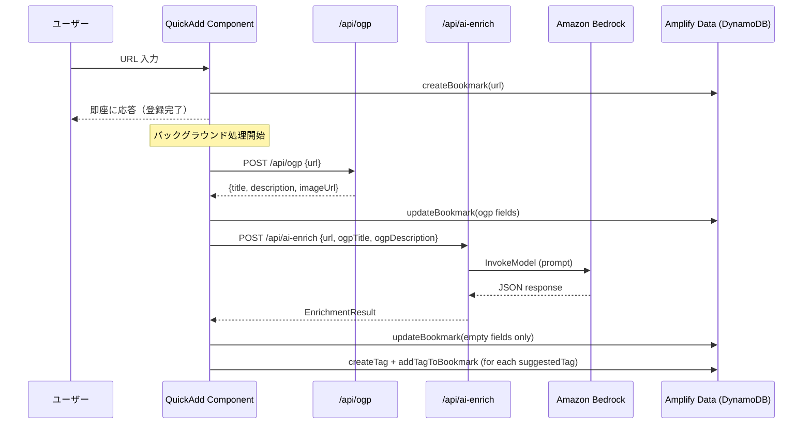

# Design Document: AI Bookmark Enrichment

## Overview

AI Bookmark Enrichment は、ブックマーク新規登録時に Amazon Bedrock を利用して、メモ（要約）・タグ候補・タイトル補完・説明補完を自動生成する機能である。

既存の OGP 取得フロー（`/api/ogp`）の後段に位置し、Next.js API Route `/api/ai-enrich` から Amazon Bedrock の InvokeModel API を直接呼び出す。フロントエンドでは OGP 取得完了後にバックグラウンドで AI 補完を実行し、結果を Bookmark レコードの空フィールドにのみ適用する。

**設計方針:**
- Graceful Degradation: Bedrock 呼び出し失敗時は空データを返し、アプリを壊さない
- 非同期バックグラウンド実行: QuickAdd の応答性を損なわない
- 既存フローへの最小限の変更: OGP 取得後に追加のフェッチを挿入するだけ

## Architecture



## Components and Interfaces

### 1. API Route: `/api/ai-enrich`

**ファイル:** `src/app/api/ai-enrich/route.ts`

```typescript
// POST /api/ai-enrich
interface EnrichmentRequest {
  url: string;
  ogpTitle?: string;
  ogpDescription?: string;
}

interface EnrichmentResult {
  suggestedTags: string[];      // 最大5個、各最大30文字
  suggestedMemo: string;        // 最大300文字
  suggestedTitle: string;       // 最大200文字（OGPタイトルが空の場合のみ生成）
  suggestedDescription: string; // 最大500文字（OGP説明が空の場合のみ生成）
}
```

**責務:**
- リクエストバリデーション（URL 必須、フォーマット検証）
- Bedrock クライアント初期化（環境変数から設定読み込み）
- プロンプト構築（URL + OGP 情報をコンテキストとして含む）
- Bedrock InvokeModel 呼び出し（8秒タイムアウト）
- レスポンス JSON パース + フィールド制約の適用
- エラー時は HTTP 200 + 空フィールドで応答

### 2. Bedrock クライアントモジュール

**ファイル:** `src/lib/ai/bedrockClient.ts`

```typescript
interface BedrockClientConfig {
  modelId: string;    // from BEDROCK_MODEL_ID
  region: string;     // from BEDROCK_REGION
  timeout: number;    // 8000ms
}

function createBedrockClient(config: BedrockClientConfig): BedrockClient;
function invokeModel(client: BedrockClient, prompt: string): Promise<string>;
```

**責務:**
- AWS SDK v3 の `@aws-sdk/client-bedrock-runtime` を使用
- IAM 認証（実行環境のクレデンシャルを自動使用）
- タイムアウト制御（AbortSignal.timeout）
- エラーハンドリング（全例外をキャッチして呼び出し元に伝播）

### 3. プロンプトビルダー

**ファイル:** `src/lib/ai/promptBuilder.ts`

```typescript
interface PromptContext {
  url: string;
  ogpTitle: string;
  ogpDescription: string;
}

function buildEnrichmentPrompt(context: PromptContext): string;
```

**責務:**
- URL、OGP タイトル、OGP 説明をプロンプトに埋め込む
- JSON 形式での応答を指示する
- OGP タイトルが空の場合はタイトル生成を指示、非空の場合は空文字を返すよう指示
- OGP 説明が空の場合は説明生成を指示、非空の場合は空文字を返すよう指示
- タグは1〜5個、各30文字以内を指示
- メモは1〜2文、300文字以内を指示
- ページの言語に合わせた出力を指示

### 4. レスポンスパーサー

**ファイル:** `src/lib/ai/responseParser.ts`

```typescript
function parseEnrichmentResponse(raw: string): EnrichmentResult;
```

**責務:**
- JSON パース（失敗時は空デフォルトを返す）
- スキーマバリデーション（期待するフィールドの存在確認）
- フィールド制約の適用（文字数制限、タグ数制限）
- 余分なフィールドの無視
- 欠落フィールドへのデフォルト値適用

### 5. フロントエンド統合: `triggerAIEnrichment`

**ファイル:** `src/app/page.tsx`（既存の `triggerOGPFetch` の後段に追加）

```typescript
function triggerAIEnrichment(
  bookmarkId: string,
  url: string,
  ogpTitle: string,
  ogpDescription: string,
): void;
```

**責務:**
- `/api/ai-enrich` への非同期 POST リクエスト
- レスポンスの EnrichmentResult を受け取り、空フィールドのみ更新
- suggestedTags を既存の `resolveTagId` + `addTagToBookmark` で適用
- エラー時はログ出力のみ（Bookmark は変更しない）
- AbortController によるキャンセル対応
- **AI トグルが OFF の場合は呼び出しをスキップする**

### 6. AI 補完トグル

**ファイル:** `src/hooks/useAIEnrichment.ts`（新規）

```typescript
interface UseAIEnrichmentReturn {
  isAIEnabled: boolean;
  setAIEnabled: (enabled: boolean) => void;
}

function useAIEnrichment(): UseAIEnrichmentReturn;
```

**責務:**
- localStorage キー `ai-enrichment-enabled` で状態を永続化
- デフォルト値は `true`（ON）
- state 変更時に即座に localStorage に書き込み
- SSR 対応（初期値は `true`、クライアントサイドで localStorage から復元）

**UI 配置:** `src/app/page.tsx` のヘッダー内、既存のアクションボタン（インポート、新規作成）の左側にトグルスイッチを配置する。

```typescript
// page.tsx ヘッダー内
<div className={styles.headerActions}>
  <label className={styles.aiToggle}>
    <input
      type="checkbox"
      checked={isAIEnabled}
      onChange={(e) => setAIEnabled(e.target.checked)}
    />
    <span>AI 補完</span>
  </label>
  {/* 既存ボタン */}
</div>
```

**CSS:** `page.module.css` に `.aiToggle` スタイルを追加。チェックボックス + ラベルのコンパクトなトグル表示。

## Data Models

### EnrichmentResult（API レスポンス型）

| フィールド | 型 | 制約 | 説明 |
|---|---|---|---|
| suggestedTags | string[] | 最大5要素、各最大30文字 | AI が提案するタグ候補 |
| suggestedMemo | string | 最大300文字 | ページ要約メモ |
| suggestedTitle | string | 最大200文字 | OGP 欠落時のタイトル補完 |
| suggestedDescription | string | 最大500文字 | OGP 欠落時の説明補完 |

### 空デフォルト値

Bedrock 呼び出し失敗、JSON パース失敗、環境変数未設定時に返すデフォルト:

```typescript
const EMPTY_ENRICHMENT: EnrichmentResult = {
  suggestedTags: [],
  suggestedMemo: "",
  suggestedTitle: "",
  suggestedDescription: "",
};
```

### 既存モデルへの影響

既存の `Bookmark` モデルのスキーマ変更は不要。AI 補完結果は既存フィールド（`title`, `description`, `memo`）と既存の Tag/BookmarkTag モデルに書き込む。

## Correctness Properties

*A property is a characteristic or behavior that should hold true across all valid executions of a system—essentially, a formal statement about what the system should do. Properties serve as the bridge between human-readable specifications and machine-verifiable correctness guarantees.*

### Property 1: レスポンスパーサーはフィールド制約を常に満たす

*For any* string input to the response parser, the returned EnrichmentResult SHALL have: suggestedTags with at most 5 elements each at most 30 characters, suggestedMemo at most 300 characters, suggestedTitle at most 200 characters, and suggestedDescription at most 500 characters.

**Validates: Requirements 1.6, 1.7, 1.8, 1.9, 3.1, 3.4**

### Property 2: 無効な入力は常に拒否される

*For any* string that is not a valid URL format, the Enrichment API validation SHALL reject it with an error indication.

**Validates: Requirements 1.3**

### Property 3: Bedrock 失敗時は常に空デフォルトを返す

*For any* type of Bedrock client failure (timeout, network error, service error, invalid response), the enrichment logic SHALL return the empty default EnrichmentResult rather than propagating the error.

**Validates: Requirements 1.4, 7.4**

### Property 4: OGP 非空フィールドは補完されない

*For any* OGP data where title is non-empty, the suggestedTitle SHALL be an empty string. *For any* OGP data where description is non-empty, the suggestedDescription SHALL be an empty string.

**Validates: Requirements 2.3, 2.4**

### Property 5: レスポンスパーサーは任意の文字列から有効な EnrichmentResult を生成する

*For any* string input (valid JSON, invalid JSON, partial JSON, empty string), the response parser SHALL always return a structurally valid EnrichmentResult with correct field types and no exceptions thrown.

**Validates: Requirements 7.3, 7.4, 8.1, 8.2, 8.3**

### Property 6: EnrichmentResult の JSON ラウンドトリップ

*For any* valid EnrichmentResult object, serializing to JSON then parsing back with the response parser SHALL produce an equivalent object.

**Validates: Requirements 8.4**

### Property 7: プロンプトは常に URL と OGP 情報を含む

*For any* valid URL and OGP data (including empty strings), the constructed prompt SHALL contain the URL string, the OGP title value, and the OGP description value.

**Validates: Requirements 7.1**

### Property 8: 空フィールドのみ更新される

*For any* Bookmark record with some fields already filled and any EnrichmentResult, the merge logic SHALL only update fields that are currently empty, leaving non-empty fields unchanged.

**Validates: Requirements 5.3, 5.6, 5.7, 5.8**

## Error Handling

### API Route レベル

| エラー条件 | レスポンス | 理由 |
|---|---|---|
| url フィールド欠落 | HTTP 400 `{ error: "url is required" }` | クライアントエラー |
| url が無効なフォーマット | HTTP 400 `{ error: "Invalid URL format" }` | クライアントエラー |
| BEDROCK_MODEL_ID 未設定 | HTTP 200 + 空 EnrichmentResult | Graceful degradation |
| Bedrock タイムアウト (8s) | HTTP 200 + 空 EnrichmentResult | Graceful degradation |
| Bedrock API エラー | HTTP 200 + 空 EnrichmentResult | Graceful degradation |
| JSON パース失敗 | HTTP 200 + 空 EnrichmentResult | Graceful degradation |
| 予期しない例外 | HTTP 200 + 空 EnrichmentResult | Graceful degradation |

### フロントエンドレベル

| エラー条件 | 動作 | 理由 |
|---|---|---|
| `/api/ai-enrich` ネットワークエラー | console.warn + Bookmark 変更なし | 非破壊的 |
| `/api/ai-enrich` 非 200 レスポンス | console.warn + Bookmark 変更なし | 非破壊的 |
| AbortController によるキャンセル | 無視（AbortError） | コンポーネントアンマウント時 |
| Tag 作成失敗 | 個別タグをスキップ、他は継続 | 部分的成功を許容 |

### 設計判断: なぜ全てのエラーで HTTP 200 を返すか

AI 補完は「あれば便利」な付加機能であり、失敗してもブックマーク登録の本質的な価値を損なわない。フロントエンドのエラーハンドリングを単純化し、ユーザーにエラーを見せないことで UX を維持する。

## Testing Strategy

### テストフレームワーク

- **ユニットテスト / プロパティテスト:** Vitest + fast-check（既にプロジェクトに導入済み）
- **統合テスト:** Vitest（モック使用）

### プロパティベーステスト（PBT）

この機能は純粋関数（パーサー、バリデーター、プロンプトビルダー、マージロジック）を多く含むため、PBT が適している。

**対象モジュール:**
- `responseParser.ts` — 任意の文字列入力に対する堅牢性
- `promptBuilder.ts` — 任意の入力に対するプロンプト構築の正確性
- API Route のバリデーションロジック — 無効 URL の拒否
- フィールドマージロジック — 空フィールドのみ更新

**PBT 設定:**
- 各プロパティテストは最低 100 イテレーション
- fast-check ライブラリを使用
- 各テストにプロパティ番号をタグ付け

### ユニットテスト（例示ベース）

- API Route の正常系レスポンス構造
- 環境変数未設定時の graceful degradation
- Bedrock クライアントのタイムアウト設定
- フロントエンド統合フローの順序（OGP → AI enrich）

### 統合テスト

- Bedrock モック使用での E2E フロー
- 日本語/英語コンテンツでの言語検出（手動確認）

### テストファイル構成

```
src/
├── lib/ai/
│   ├── responseParser.ts
│   ├── responseParser.test.ts      ← PBT: Property 1, 5, 6
│   ├── promptBuilder.ts
│   ├── promptBuilder.test.ts       ← PBT: Property 7
│   ├── bedrockClient.ts
│   └── bedrockClient.test.ts       ← Unit: timeout, config
├── app/api/ai-enrich/
│   ├── route.ts
│   └── route.test.ts               ← PBT: Property 2, 3, 4 + Unit tests
└── lib/ai/
    ├── enrichmentMerger.ts
    └── enrichmentMerger.test.ts     ← PBT: Property 8
```
