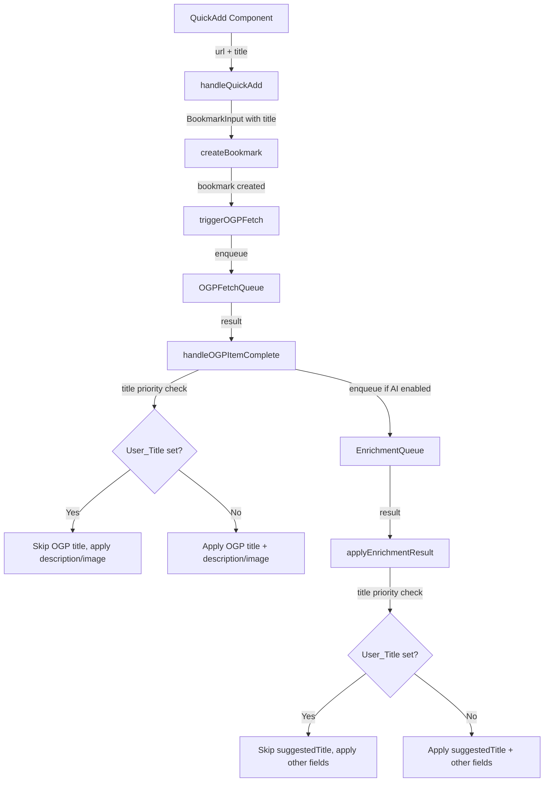

# Design Document: quick-add-title-input

## Overview

QuickAdd コンポーネントにオプションのタイトル入力欄を追加し、ユーザーが URL 登録時にタイトルを手動指定できるようにする。ユーザーが入力したタイトル（User_Title）は、後続の OGP フェッチおよび AI 補完パイプラインで取得されるタイトルよりも常に優先される。

主な変更点:
1. **QuickAdd コンポーネント**: タイトル入力フィールドの追加
2. **page.tsx の handleQuickAdd**: タイトルを `createBookmark` に渡す
3. **page.tsx の handleOGPItemComplete**: User_Title がある場合は OGP タイトルで上書きしない
4. **page.tsx の applyEnrichmentResult**: User_Title がある場合は suggestedTitle を適用しない

バックエンド変更は不要。`BookmarkInput` 型には既に `title?: string` フィールドが存在し、Amplify Data モデルの Bookmark にも `title` フィールドがある。

## Architecture



### タイトル優先度の判定方法

User_Title の有無を判定するために、`createBookmark` 時にユーザーが入力したタイトルを保存する。後続のパイプラインコールバックでは、**現在の bookmark の title が空文字列かどうか**で判定する:

- `handleOGPItemComplete`: `updateBookmark` を呼ぶ前に、対象 bookmark の現在の title を確認する。title が既に設定されている（空でない）場合は OGP title での上書きをスキップする。
- `applyEnrichmentResult`: 同様に、対象 bookmark の現在の title が空でない場合は `suggestedTitle` の適用をスキップする。

**設計判断**: bookmark の現在の title フィールドを直接参照する方式を採用する。別途 `hasUserTitle` フラグを持つ方式も検討したが、以下の理由で却下:
- 既存の Bookmark モデルへのフィールド追加が不要
- OGP/AI パイプラインの既存インターフェース（`OGPFetchItem`, `EnrichmentQueueItem`）への変更が最小限
- title が空でない = ユーザーが意図的に設定した、という前提は QuickAdd フローでは常に成立する

## Components and Interfaces

### QuickAdd コンポーネント変更

```typescript
// 変更後の Props
export interface QuickAddProps {
  /** URL とオプションのタイトルを受け取ってブックマークを作成するハンドラ */
  onAdd: (url: string, title?: string) => Promise<void>;
  /** 重複チェック */
  checkDuplicate?: (url: string) => Promise<unknown>;
}
```

**UI 構成**:
- URL 入力欄（既存、変更なし）
- タイトル入力欄（新規追加）
  - `maxLength={200}`
  - `placeholder="タイトル（任意）"`
  - `disabled={isAdding}`
- 送信ボタン（既存、変更なし）

**フォーム送信ロジック**:
1. URL をバリデーション（既存ロジック）
2. タイトルを trim
3. `onAdd(finalUrl, trimmedTitle || undefined)` を呼び出し
4. 成功時に URL とタイトルの両方をクリア

### page.tsx の handleQuickAdd 変更

```typescript
// 変更前
const handleQuickAdd = useCallback(
  async (url: string) => {
    const created = await createBookmark({ url });
    triggerOGPFetch([{ id: created.id, url: created.url }]);
  },
  [createBookmark, triggerOGPFetch],
);

// 変更後
const handleQuickAdd = useCallback(
  async (url: string, title?: string) => {
    const input: BookmarkInput = { url };
    if (title) input.title = title;
    const created = await createBookmark(input);
    triggerOGPFetch([{ id: created.id, url: created.url }]);
  },
  [createBookmark, triggerOGPFetch],
);
```

### handleOGPItemComplete の変更

```typescript
const handleOGPItemComplete = useCallback((result: OGPFetchResult) => {
  if (!result.success) return;

  const updates: Record<string, string> = {};
  // タイトル優先制御: 現在の bookmark にタイトルが設定されていない場合のみ OGP タイトルを適用
  // ※ bookmark の現在の title を参照するため、bookmarks state を使用
  const currentBookmark = bookmarksRef.current.find(b => b.id === result.bookmarkId);
  if (result.title && !currentBookmark?.title) {
    updates.title = result.title;
  }
  if (result.description) updates.description = result.description;
  if (result.imageUrl) updates.ogpImageUrl = result.imageUrl;

  if (Object.keys(updates).length > 0) {
    updateBookmarkRef.current(result.bookmarkId, updates);
  }

  // AI enrichment enqueue（既存ロジック、変更なし）
  if (isAIEnabledRef.current) {
    enrichmentQueueRef.current?.enqueue({ ... });
  }
}, []);
```

### applyEnrichmentResult の変更

```typescript
const applyEnrichmentResult = useCallback(
  (itemResult: EnrichmentItemResult) => {
    const { bookmarkId, enrichmentResult, hasCollectionId } = itemResult;
    if (!enrichmentResult) return;

    const updates: Record<string, string> = {};
    // タイトル優先制御: 現在の bookmark にタイトルが設定されていない場合のみ suggestedTitle を適用
    const currentBookmark = bookmarks.find(b => b.id === bookmarkId);
    if (enrichmentResult.suggestedTitle && !currentBookmark?.title) {
      updates.title = enrichmentResult.suggestedTitle;
    }
    // 以下は既存ロジック（変更なし）
    if (enrichmentResult.suggestedDescription) updates.description = enrichmentResult.suggestedDescription;
    if (enrichmentResult.suggestedMemo) updates.memo = enrichmentResult.suggestedMemo;
    // ... collection/tags 処理
  },
  [bookmarks, collections, updateBookmark, resolveTagId, addTagToBookmark, refreshTags],
);
```

### bookmarksRef の追加

`handleOGPItemComplete` は `useCallback` で安定化されているため、`bookmarks` state を直接参照できない。既存パターンに倣い `bookmarksRef` を追加する:

```typescript
const bookmarksRef = useRef(bookmarks);
useEffect(() => { bookmarksRef.current = bookmarks; }, [bookmarks]);
```

## Data Models

既存の型定義で対応可能。新規型の追加は不要。

| 型 | フィールド | 変更 |
|---|---|---|
| `BookmarkInput` | `title?: string` | 既存（変更なし） |
| `Bookmark` | `title: string` | 既存（変更なし） |
| `QuickAddProps` | `onAdd: (url: string, title?: string) => Promise<void>` | シグネチャ変更 |

## Correctness Properties

*A property is a characteristic or behavior that should hold true across all valid executions of a system—essentially, a formal statement about what the system should do. Properties serve as the bridge between human-readable specifications and machine-verifiable correctness guarantees.*

### Property 1: Title priority in OGP callback

*For any* bookmark with a non-empty title and *for any* OGP fetch result containing a title, applying the OGP result SHALL preserve the bookmark's existing title unchanged, while the OGP title SHALL be applied when the bookmark's title is empty.

**Validates: Requirements 3.1, 3.2**

### Property 2: Title priority in AI enrichment callback

*For any* bookmark with a non-empty title and *for any* AI enrichment result containing a suggestedTitle, applying the enrichment result SHALL preserve the bookmark's existing title unchanged, while the suggestedTitle SHALL be applied when the bookmark's title is empty.

**Validates: Requirements 4.1, 4.2**

### Property 3: Non-title metadata always applied

*For any* bookmark (regardless of whether it has a user-provided title) and *for any* pipeline result (OGP or AI enrichment) containing non-title metadata (description, imageUrl, memo, tags, collection), the non-title metadata SHALL be applied to the bookmark.

**Validates: Requirements 3.3, 4.3**

### Property 4: Title inclusion in bookmark creation

*For any* form submission with a valid URL and a title string, the title passed to the bookmark creation handler SHALL equal the trimmed title if the trimmed value is non-empty, and SHALL be undefined (omitted) if the trimmed value is empty.

**Validates: Requirements 2.1, 2.2, 6.4**

### Property 5: Both fields cleared after successful submission

*For any* successful form submission (with any valid URL and any title string), both the URL input field and the title input field SHALL be empty after the submission completes.

**Validates: Requirements 2.3**

### Property 6: Title max length enforcement

*For any* input string, the title input field SHALL not accept more than 200 characters.

**Validates: Requirements 1.4**

## Error Handling

| シナリオ | 対応 |
|---|---|
| タイトルが200文字を超える入力 | `maxLength` 属性でブラウザレベルで制限。200文字以降の入力を受け付けない |
| タイトルが空白文字のみ | trim 後に空文字列となるため、`undefined` として扱い title なしで作成 |
| OGP フェッチ失敗時 | 既存の動作と同じ。title が設定済みならそのまま保持される |
| AI 補完失敗時 | 既存の動作と同じ。title が設定済みならそのまま保持される |
| bookmark が見つからない（race condition） | `currentBookmark` が undefined の場合、title が空と同等に扱い OGP/AI タイトルを適用する（安全側に倒す） |

## Testing Strategy

### Property-Based Tests (fast-check)

プロパティベーステストには `fast-check` ライブラリを使用する。各プロパティテストは最低100回のイテレーションで実行する。

**対象プロパティ**:
- Property 1: `handleOGPItemComplete` のタイトル優先ロジックを純粋関数として抽出し、ランダムな bookmark title と OGP title の組み合わせでテスト
- Property 2: `applyEnrichmentResult` のタイトル優先ロジックを純粋関数として抽出し、ランダムな bookmark title と suggestedTitle の組み合わせでテスト
- Property 3: ランダムな OGP/AI 結果を生成し、user title の有無に関わらず非タイトルフィールドが適用されることを検証
- Property 4: ランダムな URL + タイトル文字列で QuickAdd を送信し、onAdd に渡される引数を検証
- Property 5: ランダムな URL + タイトルで送信成功後、両フィールドが空であることを検証
- Property 6: ランダムな長い文字列を生成し、200文字制限が守られることを検証

**テストタグ形式**: `Feature: quick-add-title-input, Property {number}: {property_text}`

### Unit Tests (example-based)

- QuickAdd コンポーネントのレンダリング確認（タイトル入力欄の存在、プレースホルダー）
- フォーカス初期状態の確認
- Enter キーでの送信動作
- 送信中の disabled 状態
- パイプライン継続の確認（OGP → AI enrichment が title 有無に関わらず実行される）

### Integration Tests

- QuickAdd → handleQuickAdd → createBookmark → triggerOGPFetch → handleOGPItemComplete の一連のフロー
- User_Title 設定時にパイプライン全体を通してタイトルが保持されることの確認
