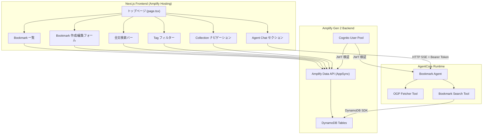
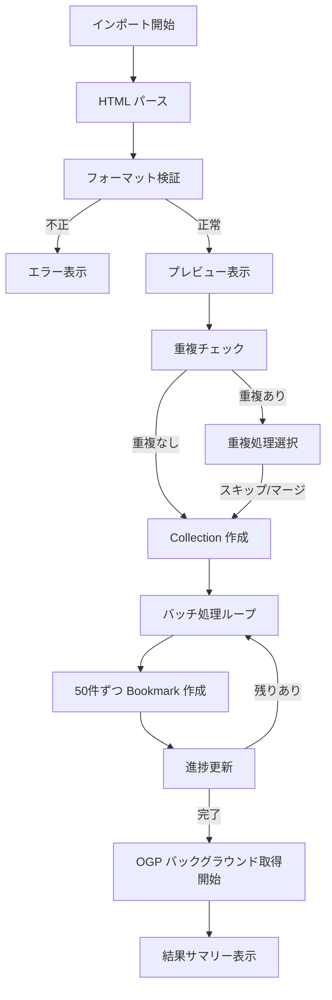
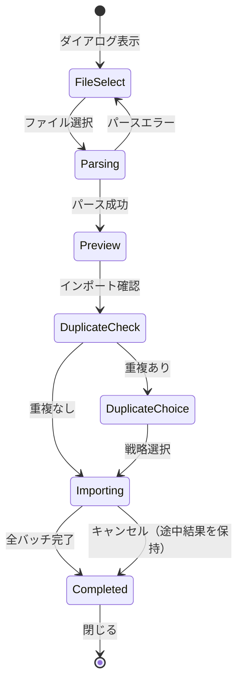
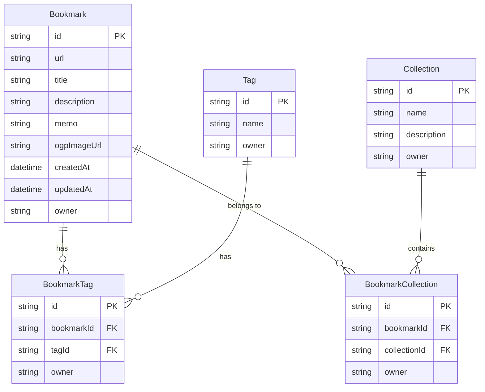

# Design Document: Rich Browser Link

## Overview

Rich Browser Link は、ブラウザのデフォルトお気に入り機能を超えるリッチなリンク管理 Web アプリケーションである。認証済みユーザーが URL を保存すると OGP メタデータを自動取得し、タグ・コレクションによる分類、全文検索、AI エージェントによる自然言語検索を提供する。

### 技術スタック

| レイヤー | 技術 |
|---------|------|
| フロントエンド | Next.js 15 + TypeScript + React 19 |
| 認証 | AWS Amplify Auth (Cognito) |
| データ | AWS Amplify Data (DynamoDB) |
| エージェント | Strands Agents SDK (Python) |
| エージェント実行基盤 | Amazon Bedrock AgentCore Runtime |
| デプロイ（Web） | Amplify Hosting |
| デプロイ（エージェント） | agentcore CLI |

### 設計方針

- トップページ（`src/app/page.tsx`）を主画面とし、サブページは作成しない
- Amplify Data の owner-based authorization でデータ分離を実現
- OGP 取得はクライアントサイドではなくエージェント側ツールで実行（CORS 制約回避）
- フロントエンドとエージェントは AgentCore Runtime の HTTP SSE エンドポイント経由で疎結合に接続

## Architecture



### アーキテクチャ決定事項

1. **OGP 取得をエージェント側で実行**: ブラウザからの直接 fetch は CORS 制約で失敗するため、Bookmark 作成時にエージェントの OGP Fetcher ツールを呼び出す。ただし、エージェント未設定時はフロントエンドから Amplify Data に URL のみで保存し、OGP は後から取得可能とする。
2. **全文検索は DynamoDB Scan + フィルタ**: 初期実装では DynamoDB の `contains` フィルタで部分一致検索を行う。データ量が増加した場合は OpenSearch への移行を検討する。
3. **Tag・Collection は別モデル + 中間テーブル**: 多対多の関係を表現するため、BookmarkTag と BookmarkCollection の中間モデルを使用する。
4. **無限スクロール**: Amplify Data の cursor-based pagination（`nextToken`）を使用して 20 件ずつ読み込む。

## Chrome ブックマークインポート設計

### HTML パーサーロジック（`src/lib/import/bookmarkParser.ts`）

Netscape Bookmark File Format は以下の構造を持つ HTML ファイルである:

```html
<!DOCTYPE NETSCAPE-Bookmark-file-1>
<META HTTP-EQUIV="Content-Type" CONTENT="text/html; charset=UTF-8">
<TITLE>Bookmarks</TITLE>
<H1>Bookmarks</H1>
<DL><p>
    <DT><H3>フォルダ名</H3>
    <DL><p>
        <DT><A HREF="https://example.com" ADD_DATE="1234567890">タイトル</A>
        <DT><H3>サブフォルダ</H3>
        <DL><p>
            <DT><A HREF="https://sub.example.com">サブタイトル</A>
        </DL><p>
    </DL><p>
</DL><p>
```

#### パーサー設計方針

1. **DOMParser ベース**: ブラウザ標準の `DOMParser` を使用して HTML をパース。外部ライブラリ不要。
2. **再帰的走査**: `<DL>` タグを再帰的に走査し、`<DT><H3>` をフォルダ、`<DT><A>` をブックマークとして抽出。
3. **フォルダパスの追跡**: 再帰走査時にフォルダパスのスタックを維持し、各ブックマークに所属フォルダのフルパスを付与。
4. **バリデーション**: `<!DOCTYPE NETSCAPE-Bookmark-file-1>` の存在確認でフォーマット検証。

```typescript
// bookmarkParser.ts の主要関数

/**
 * Netscape Bookmark File Format の HTML 文字列をパースする
 * @throws InvalidFormatError DOCTYPE ヘッダーが存在しない場合
 */
export function parseNetscapeBookmarkFile(html: string): ParseResult;

/**
 * パース結果を検証し、無効な URL をフィルタする
 * http/https スキーム以外の URL はスキップ対象
 */
export function filterValidBookmarks(bookmarks: ParsedBookmark[]): {
  valid: ParsedBookmark[];
  skipped: ParsedBookmark[];
};

/**
 * フォルダパスからフラットな Collection 名を生成する
 * ["親フォルダ", "子フォルダ"] → "親フォルダ/子フォルダ"
 * Collection 名が 100 文字を超える場合は末尾を切り詰める
 */
export function buildCollectionName(folderPath: string[]): string;
```

#### パーサーの内部アルゴリズム

```
function traverseDL(dlElement, currentPath):
  for each child <DT> in dlElement:
    if child contains <H3>:
      folderName = H3.textContent
      newPath = [...currentPath, folderName]
      add folder to results
      if next sibling is <DL>:
        traverseDL(nextDL, newPath)  // 再帰
    if child contains <A>:
      url = A.getAttribute("HREF")
      title = A.textContent
      addDate = A.getAttribute("ADD_DATE")
      add bookmark { url, title, addDate, folderPath: currentPath }
```

### バッチ処理フロー（`src/lib/import/batchProcessor.ts`）

大量のブックマーク（数百〜数千件）を効率的に処理するためのバッチ処理エンジン。

#### 処理フロー



#### バッチ処理の設計

```typescript
// batchProcessor.ts

const BATCH_SIZE = 50;

interface BatchProcessorOptions {
  bookmarks: ParsedBookmark[];
  duplicateStrategy: DuplicateStrategy;
  duplicateUrls: string[];
  onProgress: (progress: ImportProgress) => void;
  onBatchComplete: (batchIndex: number, results: BatchResult[]) => void;
  signal: AbortSignal; // キャンセル対応
}

/**
 * バッチ処理を実行する
 * - 50 件ずつ Amplify Data API を呼び出し
 * - 各バッチ間に 100ms の待機（API レート制限対策）
 * - AbortSignal でキャンセル可能
 * - 個別の失敗はスキップして継続
 */
export async function processBatches(options: BatchProcessorOptions): Promise<ImportResult>;
```

#### バッチ処理の詳細ステップ

1. **Collection 作成フェーズ**: パース結果のフォルダ構造から Collection を作成。既存の同名 Collection がある場合は再利用。
2. **Bookmark 作成フェーズ**: 50 件ずつのバッチに分割し、各バッチ内で `Promise.allSettled` を使用して並列作成。
3. **Collection 紐付けフェーズ**: 作成した Bookmark を対応する Collection に紐付け（BookmarkCollection レコード作成）。
4. **進捗更新**: 各バッチ完了時に `onProgress` コールバックで UI を更新。推定残り時間は直近 3 バッチの平均処理時間から算出。

### OGP バックグラウンド取得設計

インポート完了後、OGP メタデータをバックグラウンドで順次取得する。

#### 設計方針

1. **非ブロッキング**: インポート完了後にユーザーは通常操作を継続可能。OGP 取得は独立したプロセスとして実行。
2. **順次処理**: API レート制限を考慮し、同時実行数を 3 に制限（`Promise` ベースのセマフォ）。
3. **失敗許容**: 個別の OGP 取得失敗は無視し、Bookmark は URL のみの状態で保持。
4. **UI 反映**: OGP 取得完了した Bookmark は即座に UI に反映（React state 更新）。

```typescript
// OGP バックグラウンド取得のフロー
interface OGPBackgroundFetchOptions {
  bookmarkIds: string[];
  concurrency: number; // デフォルト 3
  onFetched: (bookmarkId: string, ogpData: OGPData) => void;
  signal: AbortSignal;
}

/**
 * バックグラウンドで OGP メタデータを順次取得する
 * - エージェントの OGP Fetcher ツールを使用
 * - 同時実行数を制限（セマフォパターン）
 * - ページ離脱時は AbortSignal でキャンセル
 */
export async function fetchOGPInBackground(options: OGPBackgroundFetchOptions): Promise<void>;
```

#### OGP 取得の実行パス

- **エージェント設定済み**: AgentCore Runtime 経由で Bookmark_Agent の OGP Fetcher ツールを呼び出し
- **エージェント未設定**: OGP 取得をスキップ。Bookmark は URL + タイトルのみで保存。ユーザーが後から個別に OGP 取得を実行可能。

### ImportDialog コンポーネント設計



#### ImportDialog の状態遷移

| 状態 | 表示内容 | ユーザーアクション |
|------|---------|-----------------|
| FileSelect | ファイルドロップゾーン + ファイル選択ボタン | HTML ファイルを選択/ドロップ |
| Parsing | ローディングスピナー | 待機 |
| Preview | ブックマーク数、フォルダ構造ツリー、無効 URL 数 | 「インポート開始」or「キャンセル」 |
| DuplicateChoice | 重複件数、「スキップ」/「マージ」ラジオボタン | 戦略を選択して「続行」 |
| Importing | ImportProgress コンポーネント | 「キャンセル」（途中まで作成済みは保持） |
| Completed | ImportResultSummary コンポーネント | 「閉じる」 |

## Components and Interfaces

### フロントエンドコンポーネント構成

```
src/
├── app/
│   ├── page.tsx                    # トップページ（メインレイアウト）
│   ├── page.module.css             # トップページスタイル
│   └── layout.tsx                  # ルートレイアウト（AmplifyProvider + Authenticator）
├── components/
│   ├── bookmark/
│   │   ├── BookmarkCard.tsx        # Bookmark カード（OGP プレビュー付き）
│   │   ├── BookmarkList.tsx        # Bookmark 一覧（無限スクロール）
│   │   ├── BookmarkForm.tsx        # Bookmark 作成/編集フォーム
│   │   ├── BookmarkDeleteDialog.tsx # 削除確認ダイアログ
│   │   ├── DuplicateDialog.tsx     # 重複確認ダイアログ
│   │   └── OGPPreviewCard.tsx      # OGP プレビューカード（ホバー表示）
│   ├── search/
│   │   └── SearchBar.tsx           # 全文検索入力（デバウンス付き）
│   ├── tag/
│   │   ├── TagInput.tsx            # Tag 入力（オートコンプリート付き）
│   │   ├── TagFilter.tsx           # Tag フィルターサイドバー
│   │   └── TagBadge.tsx            # Tag バッジ表示
│   ├── collection/
│   │   ├── CollectionList.tsx      # Collection 一覧サイドバー
│   │   ├── CollectionForm.tsx      # Collection 作成/編集フォーム
│   │   └── CollectionDeleteDialog.tsx # Collection 削除確認
│   ├── import/
│   │   ├── ImportDialog.tsx        # インポートダイアログ（ファイル選択 + プレビュー + 重複設定）
│   │   ├── ImportProgress.tsx      # インポート進捗表示（プログレスバー + 統計）
│   │   └── ImportResultSummary.tsx # インポート完了サマリー
│   └── agent/
│       ├── AgentChatSection.tsx    # エージェントチャット UI（既存を拡張）
│       ├── MessageList.tsx         # メッセージ一覧（既存を流用）
│       └── MessageInput.tsx        # メッセージ入力（既存を流用）
├── hooks/
│   ├── useBookmarks.ts            # Bookmark CRUD + ページネーション
│   ├── useTags.ts                 # Tag CRUD + オートコンプリート
│   ├── useCollections.ts          # Collection CRUD
│   ├── useSearch.ts               # 全文検索（デバウンス付き）
│   ├── useImport.ts               # Chrome ブックマークインポート処理
│   └── useAgentChat.ts            # エージェントチャット（既存を流用）
├── lib/
│   ├── agent/
│   │   └── agentRuntime.ts        # AgentCore Runtime 通信（既存）
│   ├── amplify/
│   │   └── AmplifyProvider.tsx    # Amplify 初期化（既存）
│   ├── import/
│   │   ├── bookmarkParser.ts      # Netscape Bookmark File Format パーサー
│   │   ├── batchProcessor.ts      # バッチ処理エンジン
│   │   └── types.ts               # インポート関連型定義
│   └── utils.ts                   # ユーティリティ
└── types/
    └── index.ts                   # 型定義
```

### 主要コンポーネントのインターフェース

```typescript
// BookmarkCard
interface BookmarkCardProps {
  bookmark: Bookmark;
  onEdit: (id: string) => void;
  onDelete: (id: string) => void;
}

// BookmarkList
interface BookmarkListProps {
  bookmarks: Bookmark[];
  isLoading: boolean;
  hasMore: boolean;
  onLoadMore: () => void;
  onEdit: (id: string) => void;
  onDelete: (id: string) => void;
}

// BookmarkForm
interface BookmarkFormProps {
  bookmark?: Bookmark; // 編集時は既存データを渡す
  onSubmit: (data: BookmarkInput) => Promise<void>;
  onCancel: () => void;
}

// SearchBar
interface SearchBarProps {
  onSearch: (query: string) => void;
  isSearching: boolean;
}

// TagInput
interface TagInputProps {
  selectedTags: string[];
  onChange: (tags: string[]) => void;
  maxTags?: number; // デフォルト 20
}

// CollectionList
interface CollectionListProps {
  collections: Collection[];
  selectedId: string | null;
  onSelect: (id: string | null) => void;
  onCreateNew: () => void;
}
```

### インポート機能コンポーネントのインターフェース

```typescript
// ImportDialog
interface ImportDialogProps {
  isOpen: boolean;
  onClose: () => void;
  onImportComplete: () => void;
}

// ImportProgress
interface ImportProgressProps {
  progress: ImportProgress;
  onCancel: () => void;
}

// ImportResultSummary
interface ImportResultSummaryProps {
  result: ImportResult;
  onClose: () => void;
}

// インポート関連型定義（src/lib/import/types.ts）

/** パース済みブックマークエントリ */
interface ParsedBookmark {
  url: string;
  title: string;
  addDate?: number; // UNIX timestamp
  folderPath: string[]; // ネストされたフォルダパス
}

/** パース済みフォルダ構造 */
interface ParsedFolder {
  name: string;
  path: string[]; // 親からのフルパス
  bookmarkCount: number;
}

/** パース結果 */
interface ParseResult {
  bookmarks: ParsedBookmark[];
  folders: ParsedFolder[];
  totalCount: number;
  validCount: number; // http/https スキームのみ
  skippedCount: number; // 無効スキームでスキップされた数
}

/** 重複検出結果 */
interface DuplicateCheckResult {
  duplicateUrls: string[];
  duplicateCount: number;
  newCount: number;
}

/** 重複処理戦略 */
type DuplicateStrategy = "skip" | "merge";

/** インポート進捗 */
interface ImportProgress {
  status: "idle" | "parsing" | "checking_duplicates" | "importing" | "fetching_ogp" | "completed" | "error";
  processedCount: number;
  totalCount: number;
  percentage: number;
  estimatedRemainingSeconds: number | null;
  currentBatch: number;
  totalBatches: number;
}

/** インポート結果 */
interface ImportResult {
  successCount: number;
  skippedCount: number;
  failedCount: number;
  createdCollections: number;
  failedUrls: string[];
  duration: number; // ミリ秒
}
```

### インポート用カスタムフックのインターフェース

```typescript
// useImport
interface UseImportReturn {
  /** ファイルをパースしてプレビューを生成 */
  parseFile: (file: File) => Promise<ParseResult>;
  /** 重複チェックを実行 */
  checkDuplicates: (bookmarks: ParsedBookmark[]) => Promise<DuplicateCheckResult>;
  /** インポートを実行 */
  startImport: (
    parseResult: ParseResult,
    duplicateStrategy: DuplicateStrategy
  ) => Promise<ImportResult>;
  /** インポートをキャンセル */
  cancelImport: () => void;
  /** 現在の進捗 */
  progress: ImportProgress;
  /** エラー情報 */
  error: string | null;
}
```

### カスタムフックのインターフェース

```typescript
// useBookmarks
interface UseBookmarksReturn {
  bookmarks: Bookmark[];
  isLoading: boolean;
  hasMore: boolean;
  error: string | null;
  loadMore: () => Promise<void>;
  createBookmark: (input: BookmarkInput) => Promise<Bookmark>;
  updateBookmark: (id: string, input: Partial<BookmarkInput>) => Promise<Bookmark>;
  deleteBookmark: (id: string) => Promise<void>;
  checkDuplicate: (url: string) => Promise<Bookmark | null>;
}

// useSearch
interface UseSearchReturn {
  results: Bookmark[];
  isSearching: boolean;
  query: string;
  setQuery: (q: string) => void;
}

// useTags
interface UseTagsReturn {
  tags: TagWithCount[];
  suggestions: Tag[];
  getSuggestions: (prefix: string) => void;
  createTag: (name: string) => Promise<Tag>;
  renameTag: (id: string, newName: string) => Promise<void>;
  deleteTag: (id: string) => Promise<void>;
  addTagToBookmark: (tagId: string, bookmarkId: string) => Promise<void>;
  removeTagFromBookmark: (tagId: string, bookmarkId: string) => Promise<void>;
}

// useCollections
interface UseCollectionsReturn {
  collections: Collection[];
  createCollection: (input: CollectionInput) => Promise<Collection>;
  updateCollection: (id: string, input: Partial<CollectionInput>) => Promise<void>;
  deleteCollection: (id: string) => Promise<void>;
  addBookmarkToCollection: (bookmarkId: string, collectionId: string) => Promise<void>;
  removeBookmarkFromCollection: (bookmarkId: string, collectionId: string) => Promise<void>;
}
```

### エージェント構成

```
agents/
├── common/
│   ├── __init__.py
│   ├── config.py              # 共通設定（既存）
│   └── logging.py             # ロギング（既存）
├── bookmark_agent/
│   ├── __init__.py
│   ├── agent.py               # Bookmark Agent 定義
│   ├── app.py                 # AgentCore Runtime エントリーポイント
│   └── tools.py               # ツール定義（OGP Fetcher, Bookmark Search）
├── sample_agent/              # 既存サンプル（参照用に残す）
├── pyproject.toml
└── requirements.txt
```

## Data Models

### Amplify Data Schema（`amplify/data/resource.ts`）

```typescript
import { type ClientSchema, a, defineData } from "@aws-amplify/backend";

const schema = a.schema({
  Bookmark: a
    .model({
      url: a.string().required(),
      title: a.string().default(""),
      description: a.string().default(""),
      memo: a.string().default(""),
      ogpImageUrl: a.string().default(""),
      createdAt: a.datetime(),
      updatedAt: a.datetime(),
    })
    .authorization((allow) => [allow.owner()]),

  Tag: a
    .model({
      name: a.string().required(),
    })
    .authorization((allow) => [allow.owner()]),

  BookmarkTag: a
    .model({
      bookmarkId: a.id().required(),
      tagId: a.id().required(),
      bookmark: a.belongsTo("Bookmark", "bookmarkId"),
      tag: a.belongsTo("Tag", "tagId"),
    })
    .authorization((allow) => [allow.owner()])
    .secondaryIndexes((index) => [
      index("bookmarkId"),
      index("tagId"),
    ]),

  Collection: a
    .model({
      name: a.string().required(),
      description: a.string().default(""),
    })
    .authorization((allow) => [allow.owner()]),

  BookmarkCollection: a
    .model({
      bookmarkId: a.id().required(),
      collectionId: a.id().required(),
      bookmark: a.belongsTo("Bookmark", "bookmarkId"),
      collection: a.belongsTo("Collection", "collectionId"),
    })
    .authorization((allow) => [allow.owner()])
    .secondaryIndexes((index) => [
      index("bookmarkId"),
      index("collectionId"),
    ]),
});

export type Schema = ClientSchema<typeof schema>;

export const data = defineData({
  schema,
  authorizationModes: {
    defaultAuthorizationMode: "userPool",
  },
});
```

### データモデル関連図



### 設計上の決定事項

1. **owner-based authorization**: すべてのモデルに `allow.owner()` を適用し、Cognito ユーザー ID による自動的なデータ分離を実現。他ユーザーのデータは API レベルでアクセス不可。
2. **中間テーブルパターン**: Amplify Data は直接的な many-to-many をサポートしないため、BookmarkTag / BookmarkCollection の中間モデルで多対多を表現。
3. **Secondary Index**: `bookmarkId` と `tagId` / `collectionId` にセカンダリインデックスを設定し、双方向からの効率的なクエリを可能にする。
4. **defaultAuthorizationMode を userPool に変更**: 現在の `apiKey` から `userPool` に変更し、認証必須とする。


## Correctness Properties

*A property is a characteristic or behavior that should hold true across all valid executions of a system—essentially, a formal statement about what the system should do. Properties serve as the bridge between human-readable specifications and machine-verifiable correctness guarantees.*

### Property 1: URL バリデーションの正確性

*For any* 文字列入力に対して、URL バリデーション関数は以下を満たす: スキームが http または https であり、かつ長さが 2048 文字以下の場合のみ有効と判定し、有効な URL から作成された Bookmark は正しい url フィールドと有効な ISO 8601 形式の createdAt を持つ。無効な URL（スキーム不正、長さ超過）は常に拒否される。

**Validates: Requirements 1.1, 1.4, 1.7**

### Property 2: 重複 URL 検出

*For any* Bookmark コレクションと URL に対して、当該 URL が既にコレクション内に存在する場合、checkDuplicate 関数は一致する既存 Bookmark を返し、存在しない場合は null を返す。

**Validates: Requirements 1.5**

### Property 3: Bookmark 一覧のソートとページネーション

*For any* Bookmark コレクションに対して、一覧取得は createdAt の降順でソートされ、1 ページあたり最大 20 件に制限される。

**Validates: Requirements 2.1**

### Property 4: Bookmark 編集のラウンドトリップ

*For any* 有効な編集入力（タイトル 1-200 文字、説明 0-1000 文字、メモ 0-2000 文字）に対して、Bookmark を更新した後に読み取ると、更新した値と一致するデータが返される。

**Validates: Requirements 3.1**

### Property 5: Tag 名バリデーション

*For any* 文字列に対して、Tag 名バリデーションは 1 文字以上 30 文字以下の文字列のみを受け入れ、空文字列および 31 文字以上の文字列を拒否する。

**Validates: Requirements 4.5**

### Property 6: Tag オートコンプリートの前方一致

*For any* Tag コレクションと入力プレフィックスに対して、オートコンプリート結果はすべて当該プレフィックスで始まり、最大 10 件に制限される。

**Validates: Requirements 4.2**

### Property 7: 複数 Tag による AND フィルタ

*For any* Bookmark-Tag 関連セットと Tag フィルタ条件に対して、フィルタ結果に含まれるすべての Bookmark は指定されたすべての Tag を持ち、指定された Tag のいずれかを持たない Bookmark は結果に含まれない。

**Validates: Requirements 4.3**

### Property 8: Tag ごとの Bookmark 数の正確性

*For any* Tag に対して、表示される Bookmark 数は当該 Tag に実際に紐づいている Bookmark の数と一致する。

**Validates: Requirements 4.4**

### Property 9: Tag 名変更の全 Bookmark への反映

*For any* Tag の名前変更に対して、変更後に当該 Tag が付与されたすべての Bookmark を取得すると、新しい Tag 名で関連付けられている。

**Validates: Requirements 4.7**

### Property 10: Collection 名・説明バリデーション

*For any* 文字列ペア（名前、説明）に対して、Collection 作成バリデーションは名前が 1-100 文字かつ説明が 0-500 文字の場合のみ受け入れ、それ以外を拒否する。

**Validates: Requirements 5.1, 5.6**

### Property 11: Collection への Bookmark 追加の冪等性

*For any* Bookmark と Collection の組み合わせに対して、同じ Bookmark を同じ Collection に 2 回追加しても、関連レコードは 1 つだけ存在し、2 回目の操作はエラーなく成功する。

**Validates: Requirements 5.2**

### Property 12: Collection メンバーシップフィルタの正確性

*For any* Bookmark コレクションに対して、特定の Collection を選択した場合はその Collection に属する Bookmark のみが返され、「未分類」を選択した場合はどの Collection にも属さない Bookmark のみが返される。

**Validates: Requirements 5.4, 5.5**

### Property 13: Collection 名の一意性制約

*For any* 既存の Collection 名と同一の名前で新しい Collection を作成しようとした場合、作成は拒否される。

**Validates: Requirements 5.8**

### Property 14: 全文検索の正確性

*For any* 検索キーワードと Bookmark コレクションに対して、検索結果はタイトル・説明・URL・Tag のいずれかにキーワードを含む Bookmark のみで構成され、一致フィールド数の降順でソートされ、最大 50 件に制限される。

**Validates: Requirements 6.1**

### Property 15: 検索キーワードの切り詰め

*For any* 200 文字を超える検索キーワードに対して、検索エンジンは先頭 200 文字のみを使用して検索を実行する。

**Validates: Requirements 6.5**

### Property 16: OGP フォールバック表示

*For any* Bookmark に対して、OGP タイトルが存在しない場合は URL がタイトルとして使用され、OGP 説明が存在しない場合は説明欄が非表示となる。

**Validates: Requirements 7.5**

### Property 17: エージェント Bookmark 検索の関連性

*For any* Bookmark コレクションと検索クエリに対して、エージェントの検索ツールが返す結果はクエリのキーワードをタイトル・URL・説明・Tag のいずれかに含む Bookmark のみで構成される。

**Validates: Requirements 9.2**

### Property 18: Netscape Bookmark File パーサーのラウンドトリップ

*For any* 有効な ParsedBookmark 配列（各要素が http/https スキームの URL、1-200 文字のタイトル、0 個以上のフォルダパスを持つ）に対して、Netscape Bookmark File Format の HTML 文字列を生成し、それをパーサーで再パースした結果は、元の ParsedBookmark 配列と同一の URL・タイトル・フォルダパスを持つ。

**Validates: Requirements 10.14**

### Property 19: フォルダ構造から Collection 名への変換の正確性

*For any* フォルダパス配列に対して、buildCollectionName 関数は各要素を「/」で結合した文字列を返し、結果が 100 文字を超える場合は 100 文字に切り詰める。空のフォルダパスに対しては空文字列を返す。

**Validates: Requirements 10.3**

### Property 20: 重複 URL 検出の正確性（インポート時）

*For any* ParsedBookmark 配列と既存 Bookmark 配列に対して、重複チェック関数は URL が完全一致する組み合わせのみを重複として検出し、重複件数 + 新規件数 = パース済み件数が常に成立する。

**Validates: Requirements 10.7**

### Property 21: バッチ分割の完全性

*For any* n 件の ParsedBookmark 配列に対して、50 件ずつのバッチに分割した場合、すべてのバッチの要素数の合計は n と等しく、各バッチのサイズは最大 50 件であり、元の配列の順序が保持される。

**Validates: Requirements 10.5**

### Property 22: インポート結果サマリーの整合性

*For any* インポート処理結果に対して、成功件数 + スキップ件数 + 失敗件数 = インポート対象の全件数が常に成立する。

**Validates: Requirements 10.12**

### Property 23: 無効スキーム URL のフィルタリング

*For any* ParsedBookmark 配列に対して、filterValidBookmarks 関数の結果において、valid 配列のすべての要素は http または https スキームの URL を持ち、skipped 配列のすべての要素はそれ以外のスキームを持つ。valid.length + skipped.length = 入力配列の長さが常に成立する。

**Validates: Requirements 10.13**

## Error Handling

### フロントエンドエラーハンドリング

| エラー種別 | 発生条件 | 対応 |
|-----------|---------|------|
| バリデーションエラー | URL 不正、文字数超過、空文字 | フォーム直下にインラインエラーメッセージ表示。送信ボタン無効化。 |
| 重複検出 | 同一 URL の Bookmark が既存 | DuplicateDialog で続行/中止を選択 |
| API エラー（4xx） | 認証切れ、権限不足 | トースト通知 + ログイン画面リダイレクト（401/403） |
| API エラー（5xx） | サーバー障害 | トースト通知「一時的なエラーが発生しました。しばらくしてから再試行してください。」 |
| ネットワークエラー | オフライン、タイムアウト | トースト通知「ネットワーク接続を確認してください。」 |
| OGP 取得失敗 | タイムアウト、CORS、404 | Bookmark は URL のみで保存。ユーザーへの通知なし（グレースフルデグレード）。 |
| エージェント通信エラー | AgentCore Runtime 障害 | チャットエリアにエラーメッセージ表示。会話履歴は維持。 |
| エージェント未設定 | 環境変数未設定 | チャットエリアに設定案内メッセージ。入力無効化。 |
| インポートファイル不正 | Netscape 形式でない HTML、非 HTML ファイル | ImportDialog にエラーメッセージ表示。再選択を促す。 |
| インポートファイルサイズ超過 | 10MB 超のファイル | ファイル選択時にエラーメッセージ表示。アップロード拒否。 |
| インポートバッチ部分失敗 | 個別 Bookmark 作成の API エラー | 失敗をスキップして継続。完了後に失敗一覧を表示。 |
| インポートキャンセル | ユーザーが処理中にキャンセル | 処理中のバッチ完了後に停止。作成済み Bookmark は保持。 |

### バックエンド（エージェント）エラーハンドリング

| エラー種別 | 発生条件 | 対応 |
|-----------|---------|------|
| DynamoDB アクセスエラー | 権限不足、テーブル不存在 | ログ出力 + エラーメッセージを yield |
| OGP 取得タイムアウト | 対象 URL が 10 秒以内に応答しない | 空の OGP データを返す（ツール戻り値で通知） |
| OGP パースエラー | HTML に OGP メタタグなし | 空の OGP データを返す |
| モデル呼び出しエラー | Bedrock API エラー | ログ出力 + 汎用エラーメッセージを yield |

### エラー状態の回復

- **楽観的 UI 更新**: 削除・編集操作は即座に UI に反映し、API 失敗時にロールバック
- **リトライ**: ネットワークエラー時は自動リトライしない（ユーザーの明示的な再操作を待つ）
- **セッション切れ**: 認証エラー検出時に Amplify の `fetchAuthSession` で自動リフレッシュを試行。失敗時はログイン画面へリダイレクト

## Testing Strategy

### テストレイヤー構成

| レイヤー | ツール | 対象 |
|---------|-------|------|
| 型チェック | TypeScript (`tsc --noEmit`) | フロントエンド全体 |
| Lint | ESLint | コードスタイル・品質 |
| ユニットテスト | Vitest + React Testing Library | コンポーネント、フック、ユーティリティ |
| プロパティテスト | Vitest + fast-check | バリデーション、検索、フィルタロジック |
| エージェントテスト | pytest | ツール関数、エージェント応答 |
| 統合テスト | Amplify sandbox + Vitest | データモデル、認証フロー |

### プロパティベーステスト（PBT）

本機能はバリデーション、検索、フィルタリングなど純粋なロジックを多く含むため、PBT が有効である。

**ライブラリ**: [fast-check](https://github.com/dubzzz/fast-check)（TypeScript 向け PBT ライブラリ）

**設定**:
- 各プロパティテストは最低 100 回のイテレーション
- 各テストにプロパティ番号をタグ付け
- タグ形式: `Feature: rich-browser-link, Property {number}: {property_text}`

**対象プロパティ**:
- Property 1-5: Bookmark CRUD バリデーション・ロジック
- Property 6-9: Tag 管理ロジック
- Property 10-13: Collection 管理ロジック
- Property 14-15: 全文検索ロジック
- Property 16: OGP フォールバックロジック
- Property 17: エージェント検索ツールロジック
- Property 18-23: Chrome ブックマークインポートロジック

### ユニットテスト（Example-based）

- Bookmark 作成フォームの UI 操作（送信、キャンセル）
- 重複ダイアログの表示・操作
- 削除確認ダイアログの表示・操作
- 空状態の表示
- OGP プレビューカードのホバー表示/非表示
- デバウンス動作の検証
- エージェントチャットの未設定状態・エラー状態
- ImportDialog の状態遷移（ファイル選択 → プレビュー → インポート → 完了）
- ImportProgress のプログレスバー表示・キャンセル操作
- ImportResultSummary の結果表示
- 不正ファイル形式のエラー表示
- ファイルサイズ超過のエラー表示

### 統合テスト

- Amplify Data の owner-based authorization 動作確認
- 認証フロー（ログイン → データアクセス → ログアウト）
- エージェント ↔ DynamoDB の接続確認（ローカル `run_local.py` 使用）

### エージェントテスト（Python）

- `bookmark_agent/tools.py` の各ツール関数のユニットテスト
- OGP Fetcher: モック HTTP レスポンスでのメタデータ抽出
- Bookmark Search: モック DynamoDB データでの検索ロジック
- エージェント全体のスモークテスト（`run_local.py` でのインポート・初期化確認）
