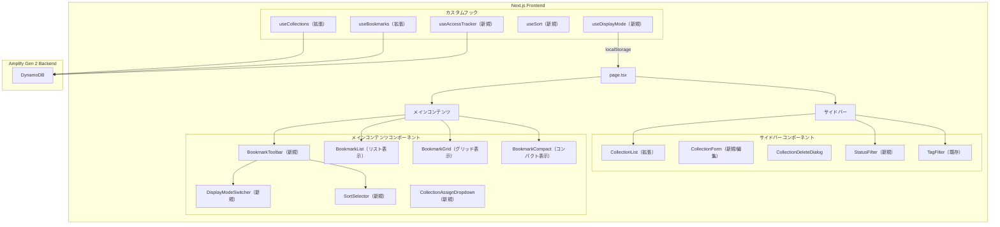
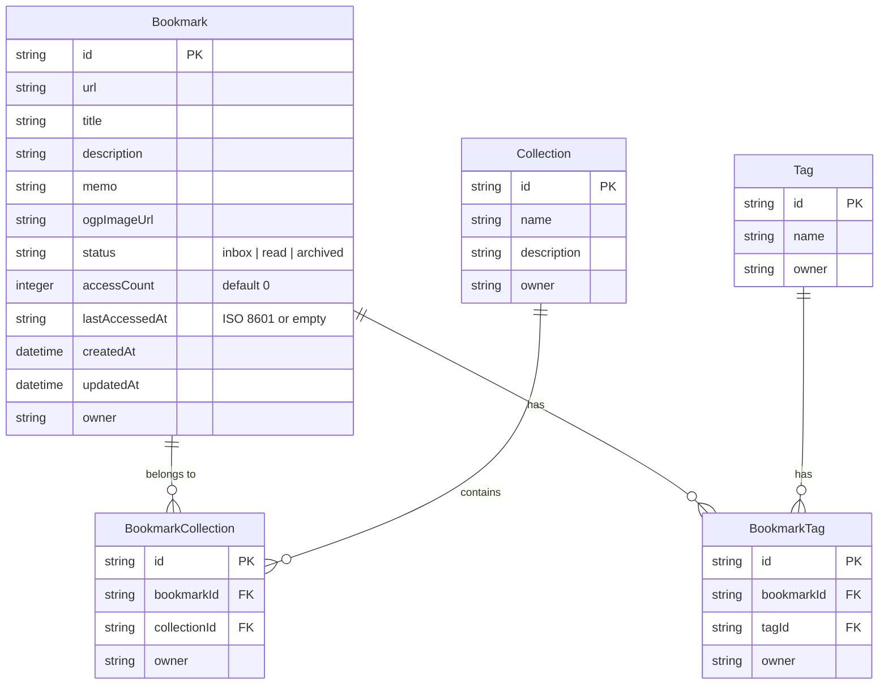

# Design Document: UX Enhancement

## Overview

Rich Browser Link アプリケーションの UX を 3 つの領域で強化する設計。既存の Next.js 15 + Amplify Gen 2 アーキテクチャを拡張し、(1) Collection 操作 UI の完全実装（CRUD + Bookmark 割り当て）、(2) 表示モード切替（リスト・グリッド・コンパクト）とファビコン自動取得、(3) Read Later ステータス管理・アクセス追跡・ソート機能を追加する。

### 設計方針

- 既存のコンポーネント構成（BookmarkCard, BookmarkList, CollectionList）を拡張し、破壊的変更を最小化する
- 表示モード設定は localStorage で永続化し、サーバーサイドへの保存は行わない
- ファビコンは Google Favicon API を利用したクライアントサイド生成（DB 保存不要）
- Bookmark モデルに `status`, `accessCount`, `lastAccessedAt` フィールドを追加（Amplify Data スキーマ変更）
- ソートはクライアントサイドで実行（DynamoDB の柔軟なソートは困難なため）

## Architecture



### アーキテクチャ決定事項

1. **表示モード切替**: 3 つの表示モード（list / grid / compact）を `useDisplayMode` フックで管理。localStorage に永続化し、ページロード時に復元する。各モードは独立したコンポーネント（BookmarkListView / BookmarkGridView / BookmarkCompactView）として実装し、BookmarkCard を共有しない（表示要件が大きく異なるため）。

2. **ファビコン取得**: Google Favicon API（`https://www.google.com/s2/favicons?domain={domain}&sz=32`）を使用。URL からドメインを抽出し、`` タグの `src` に直接設定する。画像ロードエラー時はデフォルトのグローブアイコン SVG にフォールバック。サーバーサイド保存は行わない。

3. **ソート**: クライアントサイドで実行。DynamoDB は柔軟なソートが困難（GSI が必要）であり、Bookmark 数が数百件程度の個人利用を想定しているため、全件取得後にクライアントでソートする方式で十分。

4. **アクセス追跡**: リンククリック時に `accessCount` をインクリメントし `lastAccessedAt` を更新する。楽観的 UI 更新は行わず、API 応答後に状態を反映する（カウント精度を優先）。

5. **Collection 操作 UI**: 既存の `CollectionList` を拡張し、各項目にコンテキストメニュー（編集・削除）を追加。`CollectionForm` はモーダルではなくサイドバー内インライン表示とする（画面遷移なし）。

## Components and Interfaces

### 新規コンポーネント

```typescript
// --- 表示モード切替 ---

/** 表示モードの型 */
type DisplayMode = "list" | "grid" | "compact";

/** DisplayModeSwitcher: 表示モード切替ボタングループ */
interface DisplayModeSwitcherProps {
  currentMode: DisplayMode;
  onModeChange: (mode: DisplayMode) => void;
}

// --- ソート ---

/** ソート条件の型 */
type SortKey = "createdAt" | "lastAccessedAt" | "accessCount";

/** SortSelector: ソート条件選択 UI */
interface SortSelectorProps {
  currentSort: SortKey;
  onSortChange: (sort: SortKey) => void;
}

// --- ツールバー ---

/** BookmarkToolbar: 表示モード切替 + ソート選択を含むツールバー */
interface BookmarkToolbarProps {
  displayMode: DisplayMode;
  onDisplayModeChange: (mode: DisplayMode) => void;
  sortKey: SortKey;
  onSortChange: (sort: SortKey) => void;
}

// --- ステータスフィルター ---

/** BookmarkStatus の型 */
type BookmarkStatus = "inbox" | "read" | "archived";

/** StatusFilter: ステータスフィルターセクション */
interface StatusFilterProps {
  selectedStatus: BookmarkStatus | null;
  onStatusChange: (status: BookmarkStatus | null) => void;
  counts: Record<BookmarkStatus, number>;
}

// --- Collection 割り当て ---

/** CollectionAssignDropdown: Bookmark の Collection 割り当てドロップダウン */
interface CollectionAssignDropdownProps {
  bookmarkId: string;
  collections: Collection[];
  assignedCollectionIds: string[];
  onAssign: (collectionId: string) => Promise<void>;
  onUnassign: (collectionId: string) => Promise<void>;
}

// --- グリッド表示 ---

/** BookmarkGrid: グリッド表示コンポーネント */
interface BookmarkGridProps {
  bookmarks: Bookmark[];
  tagsByBookmarkId?: Record<string, string[]>;
  onEdit: (id: string) => void;
  onDelete: (id: string) => void;
  onLinkClick: (id: string) => void;
  onStatusChange: (id: string, status: BookmarkStatus) => void;
  onAssignCollection: (bookmarkId: string) => void;
}

// --- コンパクト表示 ---

/** BookmarkCompactList: コンパクト表示コンポーネント */
interface BookmarkCompactListProps {
  bookmarks: Bookmark[];
  onEdit: (id: string) => void;
  onDelete: (id: string) => void;
  onLinkClick: (id: string) => void;
}

// --- ファビコン ---

/** Favicon: ファビコン表示コンポーネント（エラー時フォールバック付き） */
interface FaviconProps {
  url: string;
  size?: number; // デフォルト 16
}
```

### 既存コンポーネントの拡張

```typescript
// BookmarkCard の拡張（リスト表示用）
interface BookmarkCardProps {
  bookmark: Bookmark;
  tags?: string[];
  onEdit: (id: string) => void;
  onDelete: (id: string) => void;
  onLinkClick: (id: string) => void;           // 新規: アクセス追跡
  onStatusChange: (id: string, status: BookmarkStatus) => void; // 新規: ステータス変更
  onAssignCollection: (bookmarkId: string) => void; // 新規: Collection 割り当て
}

// BookmarkList の拡張
interface BookmarkListProps {
  bookmarks: Bookmark[];
  tagsByBookmarkId?: Record<string, string[]>;
  isLoading: boolean;
  hasMore: boolean;
  onLoadMore: () => void;
  onEdit: (id: string) => void;
  onDelete: (id: string) => void;
  onLinkClick: (id: string) => void;           // 新規
  onStatusChange: (id: string, status: BookmarkStatus) => void; // 新規
  onAssignCollection: (bookmarkId: string) => void; // 新規
}

// CollectionList の拡張
interface CollectionListProps {
  collections: Collection[];
  selectedId: string | null | undefined;
  onSelect: (id: string | null | undefined) => void;
  onCreateNew?: () => void;
  onEdit?: (id: string) => void;    // 新規: 編集アクション
  onDelete?: (id: string) => void;  // 新規: 削除アクション
}
```

### 新規カスタムフック

```typescript
// --- useDisplayMode ---

interface UseDisplayModeReturn {
  displayMode: DisplayMode;
  setDisplayMode: (mode: DisplayMode) => void;
}

// --- useSort ---

interface UseSortReturn {
  sortKey: SortKey;
  setSortKey: (key: SortKey) => void;
  sortBookmarks: (bookmarks: Bookmark[]) => Bookmark[];
}

// --- useAccessTracker ---

interface UseAccessTrackerReturn {
  trackAccess: (bookmarkId: string) => Promise<void>;
}
```

### 既存フックの拡張

```typescript
// useBookmarks の拡張
interface UseBookmarksReturn {
  // ... 既存のメソッド ...
  updateBookmarkStatus: (id: string, status: BookmarkStatus) => Promise<void>; // 新規
  incrementAccessCount: (id: string) => Promise<void>; // 新規
}

// useCollections の拡張（変更なし、既存の API で十分）
// - createCollection, updateCollection, deleteCollection
// - addBookmarkToCollection, removeBookmarkFromCollection
// すべて既に実装済み
```

### ファイル構成（新規追加分）

```
src/
├── components/
│   ├── bookmark/
│   │   ├── BookmarkGrid.tsx              # グリッド表示
│   │   ├── BookmarkGrid.module.css
│   │   ├── BookmarkCompactList.tsx       # コンパクト表示
│   │   ├── BookmarkCompactList.module.css
│   │   ├── BookmarkToolbar.tsx           # ツールバー
│   │   ├── BookmarkToolbar.module.css
│   │   ├── StatusBadge.tsx              # ステータスバッジ
│   │   ├── StatusBadge.module.css
│   │   └── StatusSelector.tsx           # ステータス変更 UI
│   ├── collection/
│   │   ├── CollectionAssignDropdown.tsx  # Collection 割り当て
│   │   ├── CollectionAssignDropdown.module.css
│   │   └── CollectionDeleteDialog.tsx   # 削除確認（既存）
│   ├── common/
│   │   ├── Favicon.tsx                  # ファビコン表示
│   │   ├── Favicon.module.css
│   │   ├── DisplayModeSwitcher.tsx      # 表示モード切替
│   │   ├── DisplayModeSwitcher.module.css
│   │   ├── SortSelector.tsx             # ソート選択
│   │   └── SortSelector.module.css
│   └── filter/
│       ├── StatusFilter.tsx             # ステータスフィルター
│       └── StatusFilter.module.css
├── hooks/
│   ├── useDisplayMode.ts               # 表示モード管理
│   ├── useSort.ts                      # ソート管理
│   └── useAccessTracker.ts             # アクセス追跡
└── lib/
    ├── faviconUtils.ts                 # ファビコン URL 生成
    └── sortUtils.ts                    # ソートロジック
```

## Data Models

### Amplify Data Schema 変更（`amplify/data/resource.ts`）

Bookmark モデルに 3 フィールドを追加する:

```typescript
Bookmark: a
  .model({
    url: a.string().required(),
    title: a.string().default(""),
    description: a.string().default(""),
    memo: a.string().default(""),
    ogpImageUrl: a.string().default(""),
    // --- 新規フィールド ---
    status: a.string().default("inbox"),           // "inbox" | "read" | "archived"
    accessCount: a.integer().default(0),           // アクセス回数
    lastAccessedAt: a.string().default(""),        // ISO 8601 日時（空文字 = 未アクセス）
    // --- ここまで ---
    createdAt: a.datetime(),
    updatedAt: a.datetime(),
    tags: a.hasMany("BookmarkTag", "bookmarkId"),
    collections: a.hasMany("BookmarkCollection", "bookmarkId"),
  })
  .authorization((allow) => [allow.owner()]),
```

### 型定義の拡張（`src/types/index.ts`）

```typescript
/** Bookmark ステータス */
export type BookmarkStatus = "inbox" | "read" | "archived";

/** 表示モード */
export type DisplayMode = "list" | "grid" | "compact";

/** ソートキー */
export type SortKey = "createdAt" | "lastAccessedAt" | "accessCount";

/** Bookmark エンティティ（拡張） */
export interface Bookmark {
  id: string;
  url: string;
  title: string;
  description: string;
  memo: string;
  ogpImageUrl: string;
  status: BookmarkStatus;        // 新規
  accessCount: number;           // 新規
  lastAccessedAt: string;        // 新規
  createdAt: string;
  updatedAt: string;
  owner: string;
}
```

### データモデル関連図（拡張後）



### 後方互換性

- 既存の Bookmark データに `status` フィールドが未設定の場合、`mapRecordToBookmark` で `"inbox"` にフォールバック
- `accessCount` が未設定の場合は `0` にフォールバック
- `lastAccessedAt` が未設定の場合は `""` にフォールバック
- Amplify Data のスキーマ変更は `default()` 指定により、既存レコードへの影響なし

## Correctness Properties

*A property is a characteristic or behavior that should hold true across all valid executions of a system—essentially, a formal statement about what the system should do. Properties serve as the bridge between human-readable specifications and machine-verifiable correctness guarantees.*

### Property 1: Collection 名バリデーション

*For any* 文字列入力に対して、`validateCollectionName` は 1 文字以上 100 文字以下の文字列のみを有効と判定し、空文字列および 101 文字以上の文字列を常に拒否する。

**Validates: Requirements 1.2, 1.4**

### Property 2: Collection 名の一意性制約

*For any* 既存 Collection 名の集合と入力名に対して、入力名が集合内のいずれかと完全一致する場合、作成および更新（自身以外との重複）は拒否される。入力名が集合内のどれとも一致しない場合は許可される。

**Validates: Requirements 1.5, 2.3**

### Property 3: Collection 編集バリデーション

*For any* 名前（1-100 文字）と説明（0-500 文字）の組み合わせに対して、バリデーションは有効と判定する。名前が 0 文字または 101 文字以上、もしくは説明が 501 文字以上の場合は無効と判定する。

**Validates: Requirements 2.2**

### Property 4: Collection 削除時の Bookmark 保持

*For any* Collection とそれに所属する Bookmark の集合に対して、Collection を削除した後も所属していた Bookmark は全て存在し続け、関連する BookmarkCollection レコードのみが削除される。

**Validates: Requirements 3.2**

### Property 5: Bookmark-Collection 割り当ての冪等性

*For any* Bookmark と Collection の組み合わせに対して、`addBookmarkToCollection` を 2 回実行しても BookmarkCollection レコードは 1 つだけ存在し、2 回目の操作はエラーなく成功する。

**Validates: Requirements 4.4**

### Property 6: Bookmark の複数 Collection 同時所属

*For any* Bookmark と任意の Collection 集合に対して、当該 Bookmark をすべての Collection に割り当てた後、各 Collection について BookmarkCollection レコードが存在する。

**Validates: Requirements 4.5**

### Property 7: Collection 割り当てドロップダウンの正確性

*For any* Collection 一覧と Bookmark の割り当て状態に対して、ドロップダウンは全 Collection を表示し、割り当て済みの Collection にはチェックが入り、未割り当ての Collection にはチェックが入っていない。

**Validates: Requirements 4.1**

### Property 8: リスト表示の情報完全性

*For any* Bookmark に対して、リストモードで表示されるカードにはタイトル、URL、ファビコンが含まれ、Tag が存在する場合は Tag バッジも表示される。

**Validates: Requirements 5.2**

### Property 9: グリッド表示の情報完全性

*For any* OGP 画像を持つ Bookmark に対して、グリッドモードで表示されるカードには OGP 画像、タイトル、ファビコン、Tag バッジが含まれる。

**Validates: Requirements 6.2**

### Property 10: グリッド表示の OGP フォールバック

*For any* OGP 画像を持たない Bookmark（ogpImageUrl が空文字列）に対して、グリッドモードではファビコンを拡大表示したプレースホルダーが表示される。

**Validates: Requirements 6.3**

### Property 11: コンパクト表示の最小情報表示

*For any* Bookmark に対して、コンパクトモードで表示される行にはファビコンとタイトルと URL のみが含まれ、OGP 画像と説明は表示されない。

**Validates: Requirements 7.1, 7.2**

### Property 12: 表示モード localStorage ラウンドトリップ

*For any* 有効な表示モード（"list" | "grid" | "compact"）に対して、`setDisplayMode` で保存した後に `useDisplayMode` を再初期化すると、保存したモードと同一の値が返される。

**Validates: Requirements 8.1, 8.2**

### Property 13: ファビコン URL 生成の正確性

*For any* 有効な HTTP/HTTPS URL に対して、`getFaviconUrl` はドメインを正しく抽出し、`https://www.google.com/s2/favicons?domain={domain}&sz=32` 形式の URL を返す。

**Validates: Requirements 9.1**

### Property 14: 新規 Bookmark のデフォルト値

*For any* 有効な Bookmark 入力に対して、新規作成された Bookmark は `status === "inbox"`、`accessCount === 0`、`lastAccessedAt === ""` を持つ。

**Validates: Requirements 10.1, 10.4, 12.3**

### Property 15: ステータス更新の永続化

*For any* Bookmark と有効なステータス値（"inbox" | "read" | "archived"）に対して、ステータスを更新した後に当該 Bookmark を読み取ると、更新後のステータスが返される。

**Validates: Requirements 10.3**

### Property 16: ステータスバッジの正確性

*For any* Bookmark に対して、表示されるステータスバッジは当該 Bookmark の `status` フィールドの値と一致する。

**Validates: Requirements 10.5**

### Property 17: ステータスフィルターと Collection フィルターの AND 合成

*For any* Bookmark 集合、ステータスフィルター、Collection フィルターの組み合わせに対して、フィルタ結果に含まれるすべての Bookmark は指定されたステータスを持ち、かつ指定された Collection に所属する。条件を満たさない Bookmark は結果に含まれない。

**Validates: Requirements 11.2, 11.3**

### Property 18: ステータス別 Bookmark 件数の正確性

*For any* Bookmark 集合に対して、各ステータス（inbox / read / archived）の表示件数は、当該ステータスを持つ Bookmark の実数と一致する。

**Validates: Requirements 11.4**

### Property 19: アクセス回数インクリメント

*For any* Bookmark に対して、`incrementAccessCount` を実行すると `accessCount` が正確に 1 増加する。

**Validates: Requirements 12.1**

### Property 20: 最終アクセス日時の更新

*For any* Bookmark に対して、`trackAccess` を実行すると `lastAccessedAt` が有効な ISO 8601 日時文字列に更新される。

**Validates: Requirements 12.2**

### Property 21: createdAt 降順ソート

*For any* Bookmark 配列に対して、`sortByCreatedAt` の結果は各要素の `createdAt` が前の要素以下（降順）となる。

**Validates: Requirements 13.2**

### Property 22: lastAccessedAt 降順ソート（未アクセス末尾配置）

*For any* Bookmark 配列に対して、`sortByLastAccessedAt` の結果は (1) `lastAccessedAt` が非空の Bookmark が先頭に降順で並び、(2) `lastAccessedAt` が空の Bookmark が末尾に配置される。

**Validates: Requirements 13.3**

### Property 23: accessCount 降順ソート

*For any* Bookmark 配列に対して、`sortByAccessCount` の結果は各要素の `accessCount` が前の要素以下（降順）となる。

**Validates: Requirements 13.4**

### Property 24: 後方互換マッピング

*For any* Amplify Data レコードで `status` が null/undefined の場合は `"inbox"` に、`accessCount` が null/undefined の場合は `0` に、`lastAccessedAt` が null/undefined の場合は `""` にマッピングされる。

**Validates: Requirements 14.4, 14.5**

## Error Handling

### Collection 操作エラー

| エラー種別 | 発生条件 | 対応 |
|-----------|---------|------|
| バリデーションエラー | Collection 名が空文字/100 文字超、説明が 500 文字超 | フォーム直下にインラインエラーメッセージ表示。保存ボタン無効化。 |
| 名前重複エラー | 既存 Collection と同名で作成/更新 | インラインエラーメッセージ「この名前の Collection は既に存在します」表示 |
| API エラー（作成/更新/削除） | DynamoDB 書き込み失敗 | トースト通知「操作に失敗しました。再試行してください。」 |
| 削除時の関連レコード削除失敗 | BookmarkCollection 削除中のエラー | トースト通知 + Collection 本体の削除を中止（部分削除を防ぐ） |

### 表示モード切替エラー

| エラー種別 | 発生条件 | 対応 |
|-----------|---------|------|
| localStorage 書き込み失敗 | ストレージ容量超過、プライベートブラウジング | エラーを無視し、セッション中のみモードを維持。次回アクセス時はデフォルト（list）に戻る |
| localStorage 読み込み失敗 | 不正な値が保存されている | デフォルト（list）にフォールバック |

### ファビコン取得エラー

| エラー種別 | 発生条件 | 対応 |
|-----------|---------|------|
| 画像ロードエラー | Google Favicon API が 404/タイムアウト | `` の `onError` でデフォルトグローブアイコン SVG に差し替え |
| 不正な URL | ドメイン抽出不可能な URL | デフォルトグローブアイコンを即座に表示 |

### ステータス・アクセス追跡エラー

| エラー種別 | 発生条件 | 対応 |
|-----------|---------|------|
| ステータス更新失敗 | DynamoDB 書き込みエラー | トースト通知「ステータスの更新に失敗しました」。UI を元のステータスにロールバック |
| アクセスカウント更新失敗 | DynamoDB 書き込みエラー | エラーを無視（リンク先への遷移を妨げない）。コンソールにログ出力のみ |

### ソートエラー

| エラー種別 | 発生条件 | 対応 |
|-----------|---------|------|
| 不正なソートキー | localStorage に不正な値 | デフォルト（createdAt）にフォールバック |
| 日時パースエラー | createdAt/lastAccessedAt が不正な形式 | 当該 Bookmark をソート末尾に配置 |

### エラー状態の回復

- **楽観的 UI 更新**: ステータス変更は即座に UI に反映し、API 失敗時にロールバック
- **非楽観的更新**: アクセスカウントは API 応答後に反映（カウント精度優先）
- **リトライ**: 自動リトライは行わない。ユーザーの明示的な再操作を待つ
- **グレースフルデグレード**: ファビコン取得失敗、localStorage 失敗はサイレントにフォールバック

## Testing Strategy

### テストレイヤー構成

| レイヤー | ツール | 対象 |
|---------|-------|------|
| 型チェック | TypeScript (`tsc --noEmit`) | フロントエンド全体 |
| Lint | ESLint | コードスタイル・品質 |
| ユニットテスト | Vitest + React Testing Library | コンポーネント、フック、ユーティリティ |
| プロパティテスト | Vitest + fast-check | バリデーション、ソート、フィルタ、マッピングロジック |
| 統合テスト | Amplify sandbox + Vitest | データモデル変更、CRUD 操作 |

### プロパティベーステスト（PBT）

本機能はバリデーション、ソート、フィルタリング、マッピングなど純粋なロジックを多く含むため、PBT が有効である。

**ライブラリ**: [fast-check](https://github.com/dubzzz/fast-check)（TypeScript 向け PBT ライブラリ）

**設定**:
- 各プロパティテストは最低 100 回のイテレーション
- 各テストにプロパティ番号をタグ付け
- タグ形式: `Feature: ux-enhancement, Property {number}: {property_text}`

**対象プロパティ**:
- Property 1-3: Collection バリデーションロジック
- Property 4-7: Collection 操作ロジック（削除時保持、冪等性、複数所属、ドロップダウン正確性）
- Property 8-11: 表示モード別レンダリングロジック
- Property 12: 表示モード永続化ラウンドトリップ
- Property 13: ファビコン URL 生成
- Property 14-16: ステータス管理ロジック
- Property 17-18: フィルタ合成・件数計算
- Property 19-20: アクセス追跡ロジック
- Property 21-23: ソートロジック
- Property 24: 後方互換マッピング

### ユニットテスト（Example-based）

- Collection 作成フォームの表示・送信・キャンセル操作
- Collection 編集フォームの事前入力・送信操作
- Collection 削除確認ダイアログの表示・確認・キャンセル操作
- DisplayModeSwitcher の 3 ボタン表示・選択状態
- SortSelector の 3 オプション表示・選択状態
- StatusFilter の 3 フィルター表示
- Favicon コンポーネントのエラーフォールバック
- コンパクトモードのホバー時アクション表示
- localStorage 未設定時のデフォルト値（list モード、createdAt ソート）
- リンククリック時の target="_blank" 維持

### 統合テスト

- Amplify Data スキーマ変更後の Bookmark CRUD 動作確認
- status / accessCount / lastAccessedAt フィールドの永続化確認
- Collection 削除時の BookmarkCollection カスケード削除確認
- 既存データ（新フィールド未設定）の読み込み・フォールバック確認

